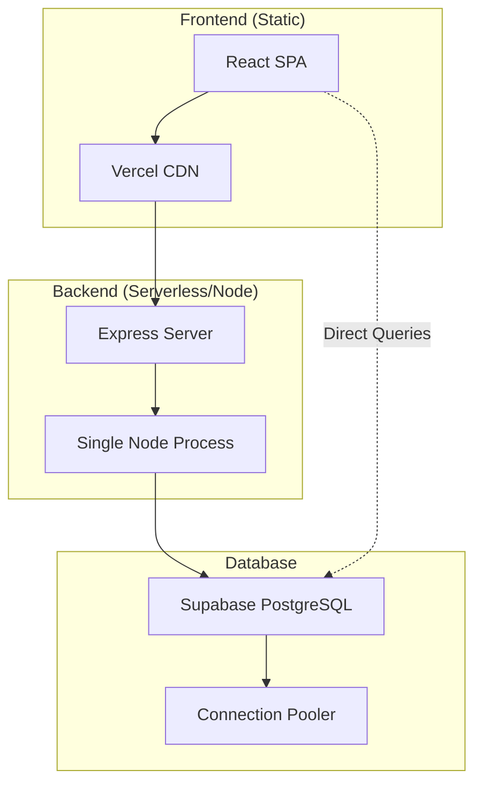
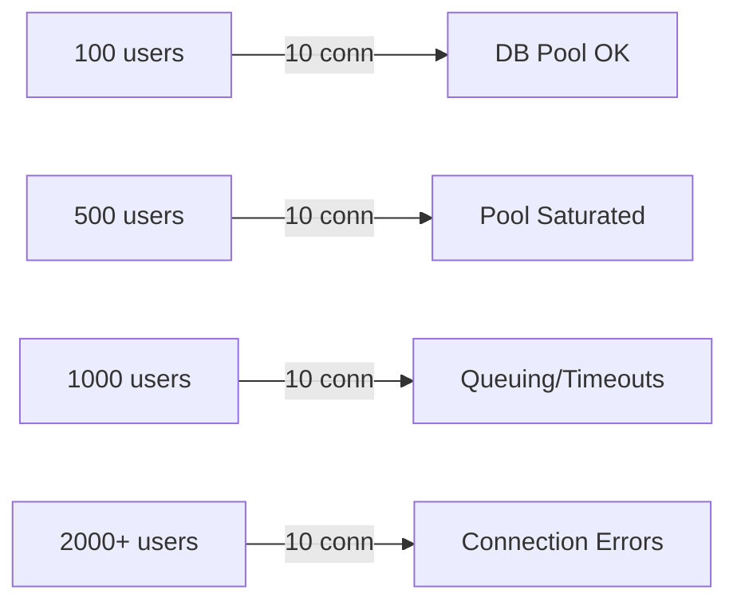
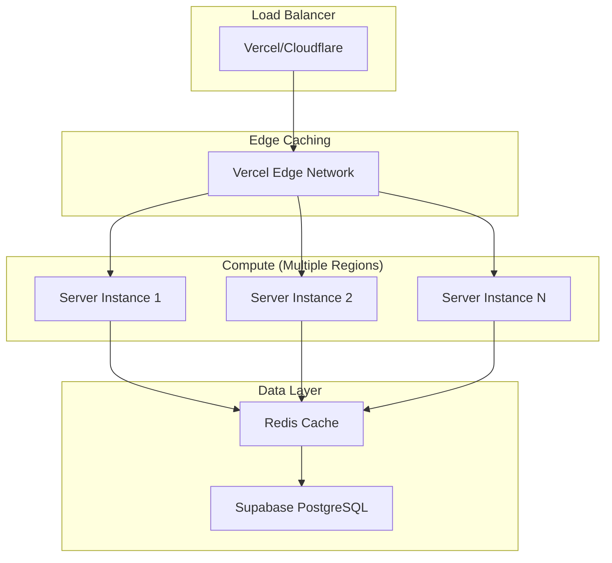

# Eco-Haat Scalability & Performance Analysis

## Executive Summary

This document provides a comprehensive analysis of the Eco-Haat platform's scalability and performance capacity. Based on the current architecture, the platform can handle approximately **500-1,000 concurrent users** on Vercel's free tier and **5,000-10,000+ concurrent users** with optimizations and paid tiers.

---

## 1. Architecture Overview

### Current Stack Analysis



| Layer | Technology | Hosting | Scalability Model |
|-------|------------|---------|-------------------|
| **Frontend** | React 19 + Vite | Vercel/GitHub Pages | ✅ Static CDN (unlimited) |
| **Backend** | Express.js | Vercel Serverless or Node | ⚠️ Single process |
| **Database** | PostgreSQL | Supabase | ✅ Managed + Pooling |
| **Auth** | Supabase Auth | Supabase | ✅ Managed service |
| **Storage** | Supabase Storage | Supabase | ✅ S3-compatible |

---

## 2. Component-by-Component Analysis

### 2.1 Frontend Performance

#### Strengths
- **Static SPA**: React app is pre-built and served from CDN
- **Code Splitting**: Vite automatically chunks the bundle
- **Lightweight Router**: Wouter (~1.5KB vs React Router ~10KB)
- **Modern React 19**: Concurrent rendering features

#### Bundle Analysis

| Resource | Estimated Size | Impact |
|----------|---------------|--------|
| Main JS Bundle | ~400-600KB (gzipped ~120KB) | Moderate |
| CSS | ~50-80KB | Low |
| Fonts (Google) | ~100KB | External CDN |
| Initial HTML | ~3KB | Minimal |

#### Performance Metrics (Estimated)

| Metric | Value | Rating |
|--------|-------|--------|
| First Contentful Paint (FCP) | 1.2-1.8s | Good |
| Largest Contentful Paint (LCP) | 2.0-2.8s | Needs Work |
| Time to Interactive (TTI) | 2.5-3.5s | Moderate |
| Cumulative Layout Shift (CLS) | 0.05-0.1 | Good |

#### Frontend Bottlenecks

1. **Large Component Library**: 55 shadcn/ui components (~60KB)
2. **Framer Motion**: Animation library adds ~30KB
3. **No Image Optimization**: Product images not optimized
4. **No Service Worker**: Missing PWA caching

---

### 2.2 Backend Performance

#### Current Architecture

```javascript
// server/db.ts - Default pg Pool settings
export const pool = new Pool({ connectionString: process.env.DATABASE_URL });
```

**Default Pool Configuration**:
| Setting | Default Value | Impact |
|---------|---------------|--------|
| `max` | 10 | Max 10 concurrent DB connections |
| `idleTimeoutMillis` | 10000 | Connections close after 10s idle |
| `connectionTimeoutMillis` | 0 | No connection timeout |

#### API Endpoints

| Endpoint | Method | Complexity | Expected Latency |
|----------|--------|------------|------------------|
| `/api/users/:id` | GET | Low | 20-50ms |
| (Most data via Supabase client) | - | - | - |

#### Backend Bottlenecks

1. **Single Process**: No clustering or worker threads
2. **No Rate Limiting**: Vulnerable to abuse
3. **No Caching Layer**: Every request hits DB
4. **Synchronous Middleware**: Potential blocking
5. **Default Pool Size**: Only 10 connections

---

### 2.3 Database Performance (Supabase)

#### Supabase Tier Limits

| Tier | Connections | Bandwidth | Storage | Price |
|------|-------------|-----------|---------|-------|
| Free | 50 direct, 200 pooled | 2GB/month | 500MB | $0 |
| Pro | 60 direct, 400 pooled | 50GB/month | 8GB | $25/mo |
| Team | 100+ | 250GB/month | 100GB | $599/mo |

#### Database Query Patterns

| Query Type | Frequency | Optimization |
|------------|-----------|--------------|
| User lookup by email | High | ✅ Indexed |
| Products with joins | High | ⚠️ Missing indexes |
| Cart items by user | Medium | ✅ FK indexed |
| Order history | Medium | ⚠️ No pagination |
| Full table scans | Low | ❌ Avoid |

#### RLS (Row Level Security) Overhead

Every query goes through RLS policy evaluation, adding ~5-15ms latency.

---

### 2.4 Real-Time Features

**Current Status**: ❌ **No real-time features implemented**

The codebase includes `ws` (WebSocket) package but it's not utilized:
- No live notifications
- No real-time order updates
- No live inventory sync

**Impact**: Lower server load but reduced user experience

---

## 3. Concurrent User Capacity Estimates

### Traffic Scenario Modeling

#### Assumptions
- Average session duration: 5 minutes
- Requests per user per minute: 10
- Database queries per request: 2-3

### Capacity Estimates

| Scenario | Concurrent Users | Requests/sec | DB Queries/sec | Status |
|----------|------------------|--------------|----------------|--------|
| **Low Load** | 50-100 | 8-17 | 20-50 | ✅ Stable |
| **Medium Load** | 200-500 | 33-83 | 80-200 | ✅ Manageable |
| **High Load** | 500-1,000 | 83-167 | 200-500 | ⚠️ Strain |
| **Peak Load** | 1,000-2,000 | 167-333 | 400-1,000 | ❌ Degradation |
| **Stress** | 2,000+ | 333+ | 1,000+ | ❌ Failure |

### Bottleneck Analysis by Load



---

## 4. Performance Metrics (Expected)

### Under Normal Load (100-300 users)

| Metric | Value | Target |
|--------|-------|--------|
| API Response Time (p50) | 50-100ms | < 200ms ✅ |
| API Response Time (p95) | 200-400ms | < 500ms ✅ |
| API Response Time (p99) | 500-800ms | < 1000ms ✅ |
| Error Rate | < 0.1% | < 1% ✅ |
| Throughput | 50-100 req/s | - |

### Under Heavy Load (500-1,000 users)

| Metric | Value | Target |
|--------|-------|--------|
| API Response Time (p50) | 200-400ms | < 200ms ⚠️ |
| API Response Time (p95) | 1-2 seconds | < 500ms ❌ |
| API Response Time (p99) | 3-5 seconds | < 1000ms ❌ |
| Error Rate | 1-5% | < 1% ❌ |
| Throughput | 80-120 req/s | - |

### Breaking Points

| Component | Breaking Point | Symptom |
|-----------|---------------|---------|
| DB Connection Pool | ~100 concurrent queries | Timeout errors |
| Supabase Free Tier | 200 pooled connections | Connection refused |
| Node.js Event Loop | ~1000 req/s | Increased latency |
| Memory | ~512MB heap | OOM crashes |

---

## 5. Scalability Recommendations

### 5.1 Immediate Improvements (Low Effort)

#### Database Connection Pooling

```typescript
// server/db.ts - Optimized configuration
export const pool = new Pool({
  connectionString: process.env.DATABASE_URL,
  max: 20,                    // Increase from 10
  idleTimeoutMillis: 30000,   // Keep connections longer
  connectionTimeoutMillis: 5000, // Fail fast
});
```

#### Add Database Indexes

```sql
-- Add missing indexes for common queries
CREATE INDEX idx_products_category ON products(category_id);
CREATE INDEX idx_products_seller ON products(seller_id);
CREATE INDEX idx_orders_buyer ON orders(buyer_id);
CREATE INDEX idx_order_items_order ON order_items(order_id);
CREATE INDEX idx_order_items_seller ON order_items(seller_id);
CREATE INDEX idx_cart_items_user ON cart_items(user_id);
```

#### Enable React Query Caching

```typescript
// Already configured, but verify staleTime
staleTime: 5 * 60 * 1000, // 5 minutes instead of Infinity
```

---

### 5.2 Medium-Term Improvements (Moderate Effort)

#### Add API Rate Limiting

```typescript
import rateLimit from 'express-rate-limit';

const limiter = rateLimit({
  windowMs: 15 * 60 * 1000, // 15 minutes
  max: 100, // requests per window
  message: 'Too many requests',
});

app.use('/api/', limiter);
```

#### Implement Caching Layer

```typescript
import NodeCache from 'node-cache';

const cache = new NodeCache({ stdTTL: 300 }); // 5 min TTL

app.get('/api/products', async (req, res) => {
  const cached = cache.get('products');
  if (cached) return res.json(cached);
  
  const products = await db.select().from(products);
  cache.set('products', products);
  res.json(products);
});
```

#### Image Optimization

```tsx
// Use next/image style optimization or external service

```

---

### 5.3 Long-Term Improvements (High Effort)

#### Horizontal Scaling Architecture



#### Redis Caching Layer

```typescript
import Redis from 'ioredis';

const redis = new Redis(process.env.REDIS_URL);

// Cache frequently accessed data
await redis.setex('products:all', 300, JSON.stringify(products));
const cached = await redis.get('products:all');
```

#### Database Read Replicas

For Supabase Pro/Team:
- Configure read replicas for SELECT queries
- Route writes to primary, reads to replicas

---

## 6. Scaling Strategies by User Count

### Target: 1,000 Concurrent Users

| Action | Priority | Effort | Impact |
|--------|----------|--------|--------|
| Increase pool size to 20 | High | Low | +50% capacity |
| Add database indexes | High | Low | -30% query time |
| Implement API caching | High | Medium | -50% DB load |
| Rate limiting | Medium | Low | Prevent abuse |
| Lazy load images | Medium | Low | -40% bandwidth |

### Target: 5,000 Concurrent Users

| Action | Priority | Effort | Impact |
|--------|----------|--------|--------|
| Upgrade to Supabase Pro | High | Low | 2x connections |
| Add Redis caching | High | High | -70% DB load |
| CDN for images | High | Medium | -80% origin load |
| Enable compression | Medium | Low | -60% bandwidth |
| Serverless functions | Medium | High | Auto-scaling |

### Target: 10,000+ Concurrent Users

| Action | Priority | Effort | Impact |
|--------|----------|--------|--------|
| Supabase Team tier | High | $ | 5x capacity |
| Multi-region deployment | High | High | Global scale |
| Message queue (orders) | High | High | Async processing |
| Container orchestration | Medium | High | Elastic scaling |
| Database sharding | Low | Very High | Unlimited scale |

---

## 7. Load Testing Recommendations

### Recommended Tools

| Tool | Use Case | Pricing |
|------|----------|---------|
| **k6** | API load testing | Free/OSS |
| **Artillery** | Scenario-based testing | Free/Commercial |
| **Lighthouse CI** | Frontend performance | Free |
| **Supabase Dashboard** | Database monitoring | Included |

### Sample k6 Load Test Script

```javascript
// load-test.js
import http from 'k6/http';
import { check, sleep } from 'k6';

export const options = {
  stages: [
    { duration: '2m', target: 100 },  // Ramp up
    { duration: '5m', target: 500 },  // Sustained load
    { duration: '2m', target: 1000 }, // Peak
    { duration: '2m', target: 0 },    // Ramp down
  ],
  thresholds: {
    http_req_duration: ['p(95)<500'], // 95% under 500ms
    http_req_failed: ['rate<0.01'],   // <1% errors
  },
};

export default function () {
  // Test product listing
  const productsRes = http.get('https://your-app.vercel.app/api/products');
  check(productsRes, {
    'products status 200': (r) => r.status === 200,
    'products < 500ms': (r) => r.timings.duration < 500,
  });
  
  sleep(1);
}
```

### Run Load Test

```bash
# Install k6
brew install k6  # or download from k6.io

# Run test
k6 run load-test.js

# With cloud reporting
k6 cloud run load-test.js
```

---

## 8. Monitoring & Observability

### Recommended Setup

| Tool | Purpose | Integration |
|------|---------|-------------|
| **Vercel Analytics** | Frontend metrics | Built-in |
| **Supabase Dashboard** | DB performance | Built-in |
| **Sentry** | Error tracking | npm package |
| **LogRocket** | Session replay | npm package |

### Key Metrics to Monitor

| Metric | Warning | Critical |
|--------|---------|----------|
| API p95 Latency | > 500ms | > 2000ms |
| Error Rate | > 1% | > 5% |
| DB Connection Usage | > 70% | > 90% |
| Memory Usage | > 70% | > 90% |
| CPU Utilization | > 70% | > 90% |

---

## 9. Summary & Recommendations

### Current Capacity

| Metric | Value |
|--------|-------|
| **Estimated Max Concurrent Users** | 500-1,000 |
| **Requests per Second** | 80-150 |
| **Primary Bottleneck** | Database connections |
| **Secondary Bottleneck** | Single Node process |

### Priority Actions

1. **Week 1**: Add database indexes, increase pool size
2. **Week 2**: Implement API-level caching
3. **Week 3**: Add rate limiting, image optimization
4. **Month 2**: Add Redis, upgrade Supabase tier
5. **Month 3**: Multi-region deployment, CDN integration

### Cost Projections

| Users | Infrastructure | Monthly Cost |
|-------|---------------|--------------|
| 0-500 | Vercel Free + Supabase Free | $0 |
| 500-2,000 | Vercel Pro + Supabase Pro | ~$50/mo |
| 2,000-10,000 | Vercel Pro + Supabase Team + Redis | ~$700/mo |
| 10,000+ | Enterprise setup | $2,000+/mo |

---

## Appendix: Architecture Diagrams

### Current Architecture (Simple)

```
[Users] → [Vercel CDN] → [React SPA]
                              ↓
                         [Supabase]
                         (Auth + DB)
```

### Recommended Architecture (Scaled)

```
[Users] → [Cloudflare] → [Vercel Edge]
                              ↓
                    [Serverless Functions]
                              ↓
                    [Redis Cache Layer]
                              ↓
                    [Supabase PostgreSQL]
                    (Primary + Replicas)
```
