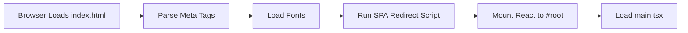

# index.html

## High-Level Summary

This is the **HTML entry point** for the Eco-Haat React application. It defines the page structure, meta tags for SEO and social sharing, font imports, and includes a GitHub Pages SPA redirect script.

## Architecture & Logic

The HTML file serves as the shell that bootstraps the React application:



## Structure Breakdown

### Document Head

#### Character Set & Viewport
```html
<meta charset="UTF-8" />
<meta name="viewport" content="width=device-width, initial-scale=1.0, maximum-scale=1" />
```

#### OpenGraph Meta Tags (Social Sharing)

| Property | Value |
|----------|-------|
| `og:title` | EcoHaat - Sustainable Products Everywhere |
| `og:description` | Bangladesh's eco-friendly marketplace... |
| `og:type` | website |
| `og:image` | OpenGraph preview image URL |

#### Twitter Card Meta Tags

| Property | Value |
|----------|-------|
| `twitter:card` | summary_large_image |
| `twitter:site` | @EcoHaat |
| `twitter:title` | EcoHaat - Sustainable Products Everywhere |
| `twitter:image` | Twitter preview image URL |

### Font Loading

Three Google Fonts are preloaded:

| Font | Purpose |
|------|---------|
| **Playfair Display** | Headings and display text (serif) |
| **Plus Jakarta Sans** | Body text (sans-serif) |
| **Poppins** | UI elements (sans-serif) |

The fonts use `display=swap` for optimal loading performance.

### PWA Manifest
```html
<link rel="manifest" href="%BASE_URL%manifest.json" />
```

Enables Progressive Web App features when properly configured.

### SPA Redirect Script

This inline JavaScript handles client-side routing on GitHub Pages:

```javascript
(function (l) {
  if (l.search[1] === '/') {
    var decoded = l.search.slice(1).split('&').map(function (s) {
      return s.replace(/~and~/g, '&')
    }).join('?');
    window.history.replaceState(null, null,
      l.pathname.slice(0, -1) + decoded + l.hash
    );
  }
}(window.location))
```

**How it works**:
1. GitHub Pages returns `404.html` for unknown routes
2. The 404 page redirects to `/?/original-path`
3. This script decodes and restores the original URL

### Document Body

```html
<body>
  <div id="root"></div>
  <script type="module" src="/src/main.tsx"></script>
</body>
```

- `#root` - React mounting point
- `main.tsx` - Application entry script (ES module)

## Variables

| Variable | Usage | Value Source |
|----------|-------|--------------|
| `%BASE_URL%` | Asset base path | Vite build config |

## Dependencies

### External Resources
- Google Fonts CDN
- GitHub Pages (for SPA routing)

### Internal Files
- `/src/main.tsx` - React application entry
- `/manifest.json` - PWA manifest
- `/favicon.png` - Browser favicon

## Notes

> [!IMPORTANT]
> The `%BASE_URL%` placeholder is replaced by Vite during build. In development, it's `/`; in production, it depends on `vite.config.ts` settings.

> [!TIP]
> The SPA redirect script works in conjunction with a `404.html` file on GitHub Pages. Without it, client-side routes would return 404 errors.

> [!NOTE]
> The `maximum-scale=1` in the viewport meta prevents zoom on mobile devices, which can improve form usability but may affect accessibility.

> [!WARNING]
> OpenGraph images should be absolute URLs (not relative) for proper social media previews.
