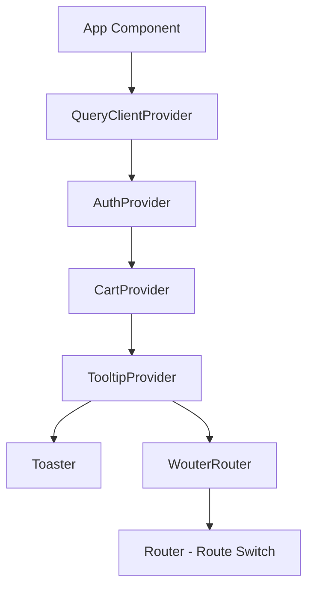

# App.tsx

## High-Level Summary

This is the **root React component** for the Eco-Haat application. It sets up the application's provider hierarchy, configures client-side routing with Wouter, and defines all available routes organized by user role (public, customer, seller, admin).

## Architecture & Logic

The app follows a nested provider pattern with client-side routing:



## Provider Hierarchy

| Order | Provider | Purpose |
|-------|----------|---------|
| 1 | `QueryClientProvider` | React Query data fetching |
| 2 | `AuthProvider` | User authentication state |
| 3 | `CartProvider` | Shopping cart state |
| 4 | `TooltipProvider` | UI tooltip context |
| 5 | `WouterRouter` | Client-side routing |

## Route Configuration

### Public Routes

| Path | Component | Description |
|------|-----------|-------------|
| `/` | `Home` | Landing page |
| `/auth` | `Auth` | Login/Register |
| `/privacy-policy` | `PrivacyPolicy` | Privacy policy page |
| `/terms-of-service` | `TermsOfService` | Terms page |

### Customer Routes

| Path | Component | Description |
|------|-----------|-------------|
| `/shop` | `CustomerShop` | Browse products |
| `/shop/cart` | `Cart` | Shopping cart |
| `/shop/checkout` | `Checkout` | Checkout flow |
| `/shop/order-confirmation/:id` | `OrderConfirmation` | Order success |
| `/shop/product/:id` | `ProductDetail` | Product details |
| `/shop/orders` | `CustomerOrders` | Order history |
| `/shops/:id` | `ShopProfile` | Seller's shop page |
| `/profile` | `Profile` | User profile |

### Seller Routes

| Path | Component | Description |
|------|-----------|-------------|
| `/seller` | `SellerDashboard` | Seller overview |
| `/seller/add-product` | `AddProduct` | Create new product |

### Admin Routes (Protected)

| Path | Component | Description |
|------|-----------|-------------|
| `/admin` | `AdminDashboard` | Admin overview |
| `/admin/verify-seller/:id` | `SellerVerificationDetail` | Verify seller |
| `/admin/verify-product/:id` | `ProductVerificationDetail` | Verify product |
| `/admin/db-fix` | `FixDatabase` | Database utilities |

### Fallback Route

| Path | Component | Description |
|------|-----------|-------------|
| `*` (any) | `NotFound` | 404 page |

## Components

### `Router()`

Internal component that defines the route switch logic.

**Returns**: JSX with `<Switch>` containing all route definitions.

### `App()`

Main component that wraps the application in providers.

**Returns**: The complete application tree.

## Route Protection

Admin routes are wrapped with `<AdminRoute>`:

```tsx
<Route path="/admin">
  <AdminRoute>
    <AdminDashboard />
  </AdminRoute>
</Route>
```

This ensures only authenticated admin users can access these pages.

## Base URL Handling

```tsx
<WouterRouter base={import.meta.env.BASE_URL.replace(/\/$/, '')}>
```

The base URL is stripped of trailing slashes for proper route matching on GitHub Pages.

## Dependencies

### External Modules
| Module | Purpose |
|--------|---------|
| `wouter` | Client-side routing |
| `@tanstack/react-query` | Data fetching provider |

### Internal Modules
| Module | Purpose |
|--------|---------|
| `@/lib/queryClient` | Query client configuration |
| `@/components/auth-provider` | Authentication context |
| `@/lib/cart-context` | Cart state management |
| `@/components/ui/toaster` | Toast notifications |
| `@/components/ui/tooltip` | Tooltip context |
| `@/components/admin-route` | Admin route protection |
| `@/pages/*` | All page components |

## Notes

> [!IMPORTANT]
> The provider order matters. `AuthProvider` must wrap `CartProvider` since the cart depends on user authentication state.

> [!TIP]
> Wouter is a lightweight routing library (~1.5KB) compared to React Router (~10KB), making it ideal for smaller applications.

> [!NOTE]
> The `NotFound` component is rendered as a fallback when no other routes match.

> [!WARNING]
> Seller routes (`/seller/*`) are not protected like admin routes. Consider adding a `SellerRoute` wrapper for production.
