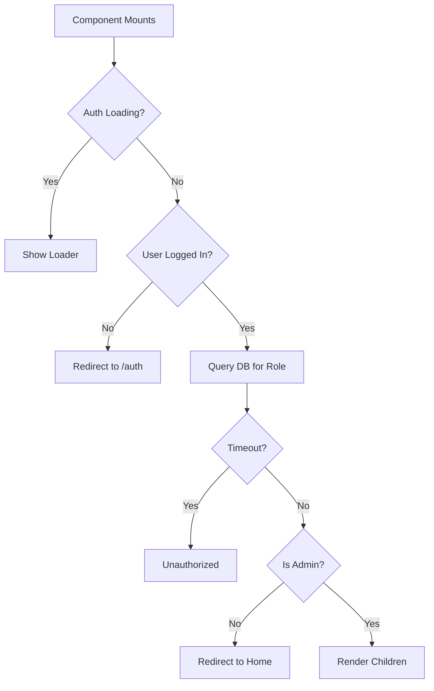

# admin-route.tsx

## High-Level Summary

A **route protection component** that restricts access to admin-only pages. It verifies the user's admin status by checking their role in the database and redirects unauthorized users.

## Architecture & Logic



## Component: `AdminRoute`

### Props

| Prop | Type | Description |
|------|------|-------------|
| `children` | `React.ReactNode` | Protected content to render |

### State

| State | Type | Description |
|-------|------|-------------|
| `isAuthorized` | `boolean \| null` | Authorization status (null = checking) |

### Authorization Logic

A user is considered an admin if:
```typescript
data.role === "admin" || data.is_super_admin === true
```

### Timeout Handling

The database query has a 5-second timeout to prevent infinite loading:

```typescript
const timeoutPromise = new Promise((_, reject) =>
    setTimeout(() => reject(new Error("Admin check timeout")), 5000)
);
```

## Render States

| State | UI |
|-------|----|
| Loading (auth or checking) | Centered spinner with "Verifying access..." |
| Not authorized | Redirect to `/` (uses setTimeout to avoid render issues) |
| Authorized | Render `{children}` |

## Usage

```tsx
import { AdminRoute } from "@/components/admin-route";

// In App.tsx routes
<Route path="/admin">
  <AdminRoute>
    <AdminDashboard />
  </AdminRoute>
</Route>
```

## Dependencies

### External Modules
| Module | Purpose |
|--------|---------|
| `react` | Hooks (useState, useEffect) |
| `wouter` | Navigation (useLocation) |
| `lucide-react` | Loader icon |

### Internal Modules
| Module | Purpose |
|--------|---------|
| `@/components/auth-provider` | User authentication state |
| `@/lib/supabase` | Database access |

## Console Logging

The component includes debug logging:
- `AdminRoute: checkAdminStatus running` - Effect triggered
- `AdminRoute: No user, redirecting to auth` - No authenticated user
- `AdminRoute: Querying DB for admin status...` - Database query started
- `AdminRoute: DB result:` - Query result
- `AdminRoute: Is admin?` - Authorization result

## Notes

> [!IMPORTANT]
> Both `role === "admin"` and `is_super_admin === true` grant admin access. Super admins have additional privileges like managing other admins.

> [!TIP]
> The 5-second timeout prevents the page from hanging indefinitely if Supabase is slow or unreachable.

> [!WARNING]
> The redirect uses `setTimeout(..., 0)` to avoid React render cycle issues. This is a workaround for redirect-during-render problems.

> [!NOTE]
> The query uses `select("*")` instead of specific columns because of observed behavior differences in Supabase's column selection.
