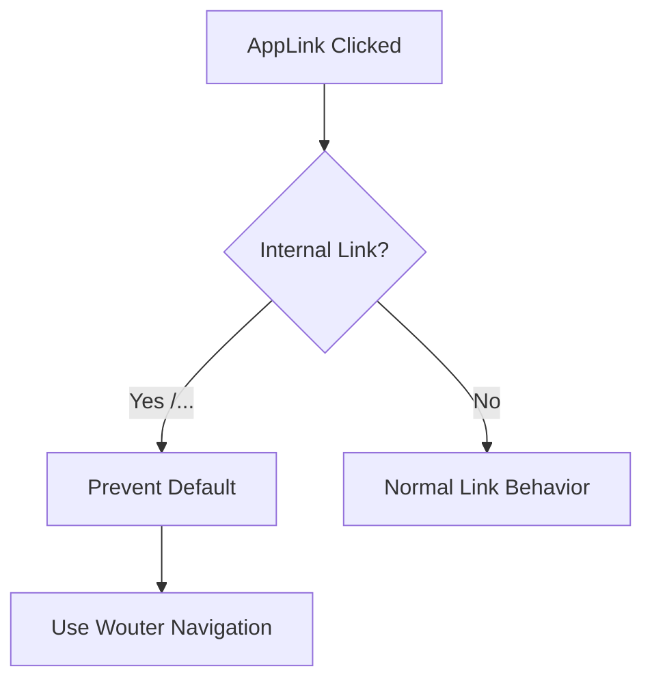

# app-link.tsx

## High-Level Summary

A custom **Link component** that handles client-side navigation with proper base URL handling for GitHub Pages deployment. It replaces Wouter's default Link to ensure correct routing in subdirectory deployments.

## Architecture & Logic



## Component: `AppLink`

### Props

| Prop | Type | Description |
|------|------|-------------|
| `href` | `string` | Target URL (required) |
| `children` | `ReactNode` | Link content |
| `onClick` | `MouseEventHandler` | Optional click handler |
| `...props` | `HTMLAnchorElement` props | Standard anchor attributes |

### URL Resolution

For internal links (starting with `/`), the base URL is automatically prepended:

```typescript
const resolvedHref = href.startsWith('/')
    ? `${import.meta.env.BASE_URL.replace(/\/$/, '')}${href}`
    : href;
```

**Example**:
- `href="/shop"` → `/eco-hat/shop` (on GitHub Pages)
- `href="/shop"` → `/shop` (on Vercel/localhost)

### Click Handling

Internal links use Wouter's `setLocation` for SPA navigation:

```typescript
if (href.startsWith('/')) {
    e.preventDefault();
    setLocation(href);  // Wouter handles base path via Router
    onClick?.(e);
}
```

## Exports

| Export | Type | Description |
|--------|------|-------------|
| `AppLink` | Component | Primary export |
| `Link` | Alias | Backward compatibility alias |

## Why This Component?

### Problem
GitHub Pages deploys to a subdirectory (`/eco-hat/`), breaking standard routing.

### Solution
This component:
1. Prepends the base URL for the `href` attribute
2. Uses Wouter's router-aware navigation for SPA behavior
3. Falls back to native anchor behavior for external links

## Usage Examples

```tsx
import { AppLink as Link } from "@/components/app-link";

// Internal navigation
<Link href="/shop">Shop</Link>

// With additional props
<Link href="/profile" className="text-primary">
  My Profile
</Link>

// External links work normally
<Link href="https://example.com">External</Link>
```

## Dependencies

### External Modules
| Module | Purpose |
|--------|---------|
| `react` | Component types |
| `wouter` | SPA navigation |

## Comparison with Wouter's Link

| Feature | Wouter Link | AppLink |
|---------|-------------|---------|
| Base URL handling | Via Router only | Explicit in href |
| External links | ❌ | ✅ |
| onClick support | ✅ | ✅ |
| TypeScript props | Basic | Full anchor props |

## Notes

> [!TIP]
> Use `AppLink` for all internal navigation to ensure compatibility with GitHub Pages deployment.

> [!NOTE]
> The alias `export { AppLink as Link }` allows easy migration from other Link components.

> [!IMPORTANT]
> The `BASE_URL` is set in `vite.config.ts` and changes based on deployment target (Vercel vs GitHub Pages).
