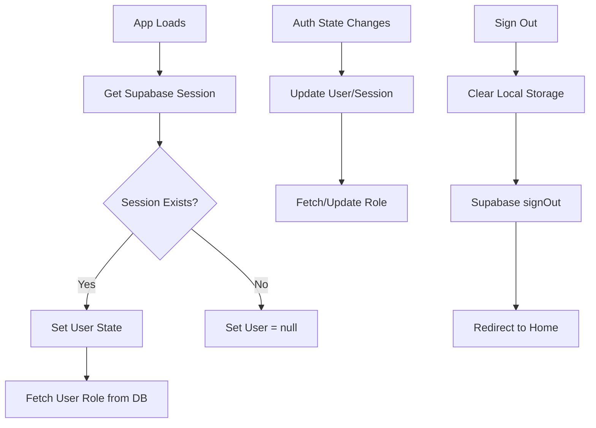

# auth-provider.tsx

## High-Level Summary

The **authentication context provider** for the Eco-Haat application. It manages user authentication state using Supabase Auth, syncs user roles from the database, and provides auth-related functions to the entire app.

## Architecture & Logic



## Context Type

```typescript
interface AuthContextType {
    user: User | null;           // Supabase user object
    session: Session | null;     // Supabase session
    loading: boolean;            // Auth loading state
    userRole: string | null;     // 'buyer', 'seller', 'admin'
    signOut: () => Promise<void>;// Sign out function
}
```

## Provider: `AuthProvider`

### State

| State | Type | Initial | Description |
|-------|------|---------|-------------|
| `user` | `User \| null` | `null` | Supabase user object |
| `session` | `Session \| null` | `null` | Supabase session |
| `loading` | `boolean` | `true` | Loading indicator |
| `userRole` | `string \| null` | from localStorage | User's role |

### Role Caching

The user role is cached in `localStorage` for faster subsequent loads:

```typescript
const cachedRole = localStorage.getItem("userRole");
```

## Functions

### `fetchUserRole(email, isMounted, retryCount)`

**Purpose**: Fetches the user's role from the database with retry logic.

**Parameters**:
| Param | Type | Description |
|-------|------|-------------|
| `email` | `string` | User's email |
| `isMounted` | `() => boolean` | Component mount check |
| `retryCount` | `number` | Current retry attempt |

**Logic Flow**:
1. Check localStorage cache (skip DB if cached)
2. Query Supabase with 5-second timeout
3. If user exists → set role from DB
4. If `PGRST116` (not found) → retry up to 2 times, then create user
5. On error → use cached role or default to "buyer"

**User Creation** (when user doesn't exist):
```typescript
{
  user_id: `USR-${dateStr}-${randomId}`,
  username: email.split("@")[0],
  email: email,
  role: "buyer"
}
```

---

### `signOut()`

**Purpose**: Signs out the user and clears all auth state.

**Steps**:
1. Clear `userRole` from localStorage
2. Call `supabase.auth.signOut()` with 3-second timeout
3. Clear all Supabase auth tokens from localStorage
4. Reset all state to null
5. Redirect to homepage

**Cleanup Pattern**:
```typescript
for (const key of Object.keys(localStorage)) {
    if (key.startsWith('sb-') && key.includes('-auth')) {
        localStorage.removeItem(key);
    }
}
```

## Hook: `useAuth()`

**Purpose**: Access auth context from any component.

**Throws**: Error if used outside `AuthProvider`.

**Usage**:
```tsx
function MyComponent() {
    const { user, userRole, signOut, loading } = useAuth();
    
    if (loading) return <Spinner />;
    if (!user) return <LoginPrompt />;
    
    return <div>Welcome, {user.email}</div>;
}
```

## Auth State Subscription

The provider subscribes to Supabase auth state changes:

```typescript
supabase.auth.onAuthStateChange(async (_event, session) => {
    setSession(session);
    setUser(session?.user ?? null);
    if (session?.user?.email) {
        await fetchUserRole(session.user.email, isMounted);
    }
});
```

## Dependencies

### External Modules
| Module | Purpose |
|--------|---------|
| `react` | Context, hooks |
| `@supabase/supabase-js` | Auth types |

### Internal Modules
| Module | Purpose |
|--------|---------|
| `@/lib/supabase` | Supabase client |

## Timeout Handling

| Operation | Timeout | Fallback |
|-----------|---------|----------|
| Role query | 5 seconds | Use cached/default role |
| Sign out | 3 seconds | Continue with local cleanup |

## Notes

> [!IMPORTANT]
> The `AuthProvider` must wrap the entire application. It's placed near the top of the component tree in `App.tsx`.

> [!TIP]
> The role is cached in localStorage, so returning users see their role immediately without waiting for a DB query.

> [!WARNING]
> The sign-out function uses `window.location.href = "/"` for a full page reload, ensuring all state is cleared.

> [!NOTE]
> New users are automatically created with the "buyer" role when they first sign in. The user ID format is `USR-YYYYMMDD-XXX`.
