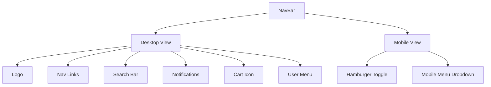

# navbar.tsx

## High-Level Summary

The main **navigation bar component** for the Eco-Haat application. It provides site navigation, search functionality, cart access, notifications, and user account management with responsive mobile support.

## Architecture & Logic



## Component: `NavBar`

### Props

| Prop | Type | Description |
|------|------|-------------|
| `onSearch` | `(query: string) => void` | Optional search callback |

### State

| State | Type | Description |
|-------|------|-------------|
| `mobileMenuOpen` | `boolean` | Mobile menu visibility |
| `searchQuery` | `string` | Current search input |

## UI Sections

### Header Bar
- **Logo**: Links to homepage with EcoHaat branding
- **Nav Links** (desktop): Shop, Categories, Contact Us
- **Search Bar** (desktop): Live search with icon
- **Actions**: Notifications, Cart, User Menu/Sign In

### User Menu

For authenticated users, shows a dropdown with:
- Account label
- Dashboard/Profile link (role-based)
- Logout button

**Role-Based Navigation**:
| Role | Dashboard Link | Label |
|------|----------------|-------|
| `admin` | `/admin` | Admin Panel |
| `seller` | `/seller` | Seller Dashboard |
| `buyer` | `/profile` | Profile |

### Mobile Menu

Triggered by hamburger icon, includes:
- Search input
- Nav links (Shop, Categories, Contact)
- Notifications toggle
- Dashboard/Profile button
- Logout button

## Animation

Uses Framer Motion for mobile menu animation:

```tsx
<motion.div
    initial={{ opacity: 0, y: -10 }}
    animate={{ opacity: 1, y: 0 }}
>
```

## Styling

| Element | Classes | Description |
|---------|---------|-------------|
| Header | `sticky top-0 z-50 bg-background/80 backdrop-blur-xl` | Sticky with blur effect |
| Nav Links | `text-foreground/70 hover:text-primary` | Subtle hover effect |
| User Button | `bg-primary/5 hover:bg-primary/10` | Light primary background |
| Mobile Menu | `border-t bg-background p-4` | Clean mobile layout |

## Features

### Search
```tsx
const handleSearch = (e: React.ChangeEvent<HTMLInputElement>) => {
    const query = e.target.value;
    setSearchQuery(query);
    if (onSearch) onSearch(query);
};
```

### Cart Badge
Shows item count (currently hardcoded as `3`, should connect to cart context).

### Responsive Breakpoints
- Desktop (lg+): Full nav with search bar
- Tablet (md-lg): Actions visible, nav hidden
- Mobile (<md): Hamburger menu

## Dependencies

### External Modules
| Module | Purpose |
|--------|---------|
| `react` | Component state |
| `lucide-react` | Icons |
| `framer-motion` | Animations |

### Internal Modules
| Module | Purpose |
|--------|---------|
| `@/components/app-link` | SPA navigation |
| `@/components/auth-provider` | User state |
| `./notifications` | Notification center |
| `@/components/ui/*` | UI components |

## Usage

```tsx
import { NavBar } from "@/components/navbar";

function Page() {
    const handleSearch = (query: string) => {
        console.log("Searching:", query);
    };
    
    return (
        <>
            <NavBar onSearch={handleSearch} />
            <main>...</main>
        </>
    );
}
```

## Notes

> [!TIP]
> The cart badge count (`3`) is hardcoded. Connect it to `useCart().itemCount` for live updates.

> [!NOTE]
> The `touch-target` and `touch-manipulation` classes improve mobile tap targets and prevent zoom on double-tap.

> [!IMPORTANT]
> The logo path uses `import.meta.env.BASE_URL` for correct path resolution on GitHub Pages.

> [!WARNING]
> The mobile menu doesn't auto-close on route change. Consider adding `useEffect` to close it when location changes.
