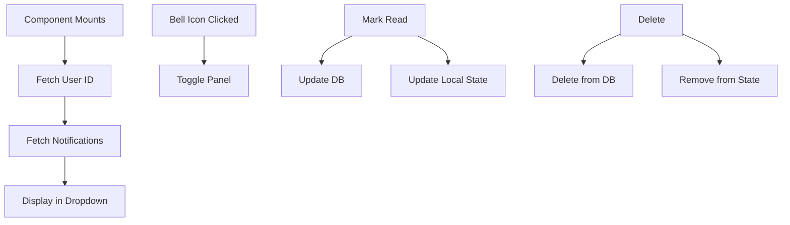

# notifications.tsx

## High-Level Summary

A **notification center component** that displays user notifications in a dropdown panel. It fetches notifications from Supabase, supports real-time updates, and provides mark-as-read and delete functionality.

## Architecture & Logic



## Types

### `Notification`

```typescript
interface Notification {
    id: number;
    title: string;
    message: string;
    type: "info" | "success" | "warning" | "error";
    read: boolean;
    created_at: string;
}
```

## Component: `NotificationCenter`

### State

| State | Type | Description |
|-------|------|-------------|
| `notifications` | `Notification[]` | User's notifications |
| `isOpen` | `boolean` | Panel visibility |
| `loading` | `boolean` | Fetching state |
| `userId` | `number \| null` | Current user's DB ID |

### Functions

#### `fetchNotifications()`
Fetches notifications ordered by creation date (newest first), limited to 20.

#### `markAsRead(id: number)`
Marks a single notification as read in the database and updates local state.

#### `markAllRead()`
Marks all notifications as read with a batch update.

#### `deleteNotification(id: number, e: React.MouseEvent)`
Deletes a notification from the database and removes it from local state.

#### `handleClickOutside(event: MouseEvent)`
Closes the panel when clicking outside (registered via document event listener).

## UI Elements

### Bell Icon Button
- Shows notification count badge for unread items
- Animated with Framer Motion on hover/tap

### Notification Panel
- Header with "Notifications" title and "Mark all read" button
- Scrollable list of notifications
- Empty state with icon and message

### Notification Item
- Type-based icon (Info, Check, Alert, X)
- Title and truncated message
- Time ago display
- Delete button
- Unread indicator (left border)

## Icon Mapping

| Type | Icon | Color |
|------|------|-------|
| `info` | `Info` | Blue |
| `success` | `Check` | Green |
| `warning` | `AlertTriangle` | Yellow |
| `error` | `X` | Red |

## Helper Function: `createNotification`

**Purpose**: Create a new notification for a user.

```typescript
export async function createNotification(
    userId: number,
    title: string,
    message: string,
    type: "info" | "success" | "warning" | "error" = "info"
)
```

**Usage**:
```typescript
import { createNotification } from "@/components/notifications";

// In an order processing function
await createNotification(
    buyer.id,
    "Order Confirmed",
    "Your order #12345 has been confirmed!",
    "success"
);
```

## Animation

Uses Framer Motion's `AnimatePresence` for panel enter/exit:

```tsx
<AnimatePresence>
    {isOpen && (
        <motion.div
            initial={{ opacity: 0, y: 10, scale: 0.95 }}
            animate={{ opacity: 1, y: 0, scale: 1 }}
            exit={{ opacity: 0, y: 10, scale: 0.95 }}
        >
```

## Dependencies

### External Modules
| Module | Purpose |
|--------|---------|
| `react` | Hooks |
| `lucide-react` | Icons |
| `framer-motion` | Animations |

### Internal Modules
| Module | Purpose |
|--------|---------|
| `@/lib/supabase` | Database access |
| `@/components/auth-provider` | Current user |
| `@/components/ui/button` | Button component |

## Database Schema

Uses the `notifications` table:

| Column | Type | Description |
|--------|------|-------------|
| `id` | SERIAL | Primary key |
| `user_id` | INTEGER | FK to users |
| `title` | TEXT | Notification title |
| `message` | TEXT | Notification body |
| `type` | TEXT | info/success/warning/error |
| `read` | BOOLEAN | Read status |
| `created_at` | TIMESTAMP | Creation time |

## Notes

> [!TIP]
> Use the exported `createNotification` helper to send notifications from anywhere in the app (e.g., after order placement, seller verification, etc.).

> [!NOTE]
> Notifications are limited to the 20 most recent per user. Consider adding pagination for users with many notifications.

> [!WARNING]
> The click-outside handler is added to `document`. Ensure proper cleanup on unmount to avoid memory leaks.

> [!IMPORTANT]
> Only authenticated users see the notification center. It returns null if no user is logged in.
