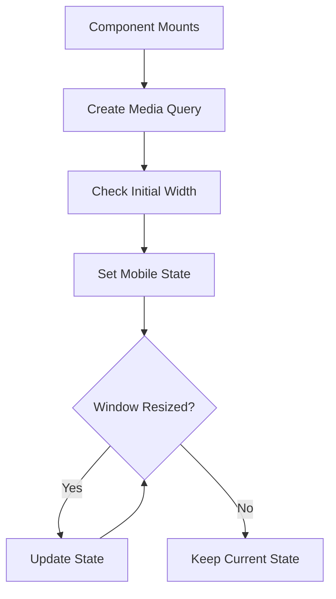

# use-mobile.tsx

## High-Level Summary

A custom React hook that detects whether the user is on a **mobile device** based on viewport width. It uses the CSS media query approach and updates reactively when the window is resized.

## Architecture & Logic



## Constants

| Constant | Value | Description |
|----------|-------|-------------|
| `MOBILE_BREAKPOINT` | `768` | Width threshold (matches Tailwind's `md` breakpoint) |

## Hook: `useIsMobile()`

**Returns**: `boolean` - `true` if viewport width < 768px, `false` otherwise.

### Initial Render Behavior

On first render, `isMobile` is `undefined`, and the hook returns `false` (via `!!undefined`). After the effect runs, it updates with the actual value.

### Implementation Details

```typescript
const mql = window.matchMedia(`(max-width: ${MOBILE_BREAKPOINT - 1}px)`)
```

Creates a media query for `(max-width: 767px)`.

```typescript
mql.addEventListener("change", onChange)
```

Listens for viewport changes (e.g., window resize, device rotation).

```typescript
return () => mql.removeEventListener("change", onChange)
```

Cleanup prevents memory leaks when the component unmounts.

## Usage Example

```tsx
import { useIsMobile } from "@/hooks/use-mobile";

function ResponsiveComponent() {
  const isMobile = useIsMobile();
  
  return (
    <div>
      {isMobile ? (
        <MobileNavigation />
      ) : (
        <DesktopNavigation />
      )}
    </div>
  );
}
```

## Dependencies

### External Modules
| Module | Purpose |
|--------|---------|
| `react` | React hooks (useState, useEffect) |

### Browser APIs
| API | Purpose |
|-----|---------|
| `window.matchMedia` | CSS media query matching |
| `window.innerWidth` | Viewport width detection |

## Comparison with CSS Approach

| Approach | Pros | Cons |
|----------|------|------|
| **This Hook** | Conditional JS/components | Extra render on mount |
| **CSS Media Queries** | No extra renders | Can't conditionally render |
| **CSS Container Queries** | Component-level responsive | Limited browser support |

## Notes

> [!TIP]
> Use this hook when you need to conditionally render different components (not just styles) based on screen size.

> [!NOTE]
> The breakpoint (768px) matches Tailwind CSS's `md` breakpoint. Devices narrower than this are considered "mobile."

> [!WARNING]
> On initial render, the hook returns `false` before the effect runs. If you need accurate SSR/hydration, consider using a different approach.
