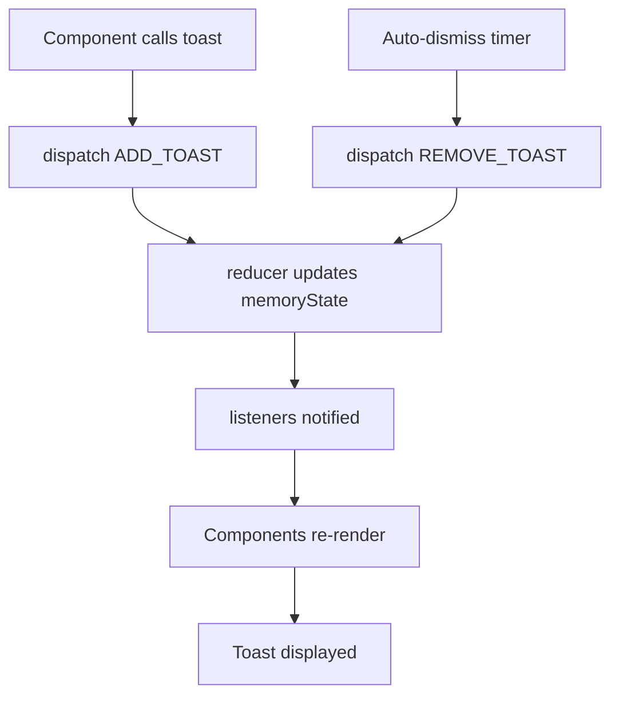

# use-toast.ts

## High-Level Summary

A **toast notification system** built with React. It provides a global state management solution for displaying toast messages without requiring prop drilling. Uses a reducer pattern similar to Redux but with direct dispatch calls.

## Architecture & Logic

The hook implements a publish-subscribe pattern with a reducer:



## Constants

| Constant | Value | Description |
|----------|-------|-------------|
| `TOAST_LIMIT` | `1` | Maximum toasts displayed at once |
| `TOAST_REMOVE_DELAY` | `1000000` | Milliseconds before auto-removal (~16 min) |

## Types

### `ToasterToast`

Extended toast properties:

| Property | Type | Description |
|----------|------|-------------|
| `id` | `string` | Unique identifier |
| `title` | `ReactNode` | Toast heading |
| `description` | `ReactNode` | Toast body |
| `action` | `ToastActionElement` | Optional action button |
| `...ToastProps` | - | Base toast styling props |

### Action Types

| Action | Purpose |
|--------|---------|
| `ADD_TOAST` | Add new toast to queue |
| `UPDATE_TOAST` | Modify existing toast |
| `DISMISS_TOAST` | Mark toast as closing |
| `REMOVE_TOAST` | Remove toast from DOM |

## Functions

### `toast(props: Toast)`

**Purpose**: Display a new toast notification.

**Parameters**: Toast properties (title, description, variant, etc.)

**Returns**: 
```typescript
{
  id: string;      // Toast identifier
  dismiss: () => void;  // Manually dismiss
  update: (props) => void;  // Update toast content
}
```

**Example**:
```typescript
const { dismiss } = toast({
  title: "Success!",
  description: "Your order has been placed.",
  variant: "default",
});

// Later...
dismiss();
```

---

### `useToast()`

**Purpose**: Subscribe to toast state and get toast controls.

**Returns**:
```typescript
{
  toasts: ToasterToast[];  // Current toasts
  toast: (props) => {...}; // Show new toast
  dismiss: (id?) => void;  // Dismiss toast(s)
}
```

**Example**:
```typescript
function MyComponent() {
  const { toast, toasts } = useToast();
  
  return (
    <button onClick={() => toast({ title: "Clicked!" })}>
      Show Toast
    </button>
  );
}
```

---

### `reducer(state: State, action: Action): State`

**Purpose**: Pure reducer function for toast state management.

| Action | Behavior |
|--------|----------|
| `ADD_TOAST` | Prepends toast, limits to `TOAST_LIMIT` |
| `UPDATE_TOAST` | Updates toast by ID |
| `DISMISS_TOAST` | Sets `open: false`, queues removal |
| `REMOVE_TOAST` | Removes toast from array |

---

### `genId()`

**Purpose**: Generates unique toast IDs.

Uses a cycling counter that wraps at `MAX_SAFE_INTEGER`.

---

### `addToRemoveQueue(toastId: string)`

**Purpose**: Schedules toast removal after delay.

Prevents duplicate timers for the same toast.

## State Management

### Global State Pattern

```typescript
let memoryState: State = { toasts: [] };
const listeners: Array<(state: State) => void> = [];

function dispatch(action: Action) {
  memoryState = reducer(memoryState, action);
  listeners.forEach(listener => listener(memoryState));
}
```

This pattern allows `toast()` to be called from anywhere, not just React components.

## Dependencies

### External Modules
| Module | Purpose |
|--------|---------|
| `react` | Hooks and types |

### Internal Modules
| Module | Purpose |
|--------|---------|
| `@/components/ui/toast` | Toast component types |

## Usage Tips

### Outside React Components

```typescript
import { toast } from "@/hooks/use-toast";

// In API utilities, event handlers, etc.
async function submitForm() {
  try {
    await api.submit();
    toast({ title: "Submitted!" });
  } catch (e) {
    toast({ title: "Error", variant: "destructive" });
  }
}
```

### With Actions

```typescript
toast({
  title: "Item deleted",
  action: (
    <ToastAction altText="Undo" onClick={undoDelete}>
      Undo
    </ToastAction>
  ),
});
```

## Notes

> [!TIP]
> The `toast()` function can be imported and called from anywhere in your app, not just inside React components.

> [!NOTE]
> The long `TOAST_REMOVE_DELAY` (16+ minutes) means toasts stay until dismissed by the user or animation completes.

> [!WARNING]
> The listener cleanup in `useEffect` depends on `state`, which may cause extra re-subscriptions. Consider using `useRef` for listeners.

> [!IMPORTANT]
> Only one toast is shown at a time due to `TOAST_LIMIT = 1`. Increase this if you need multiple concurrent toasts.
