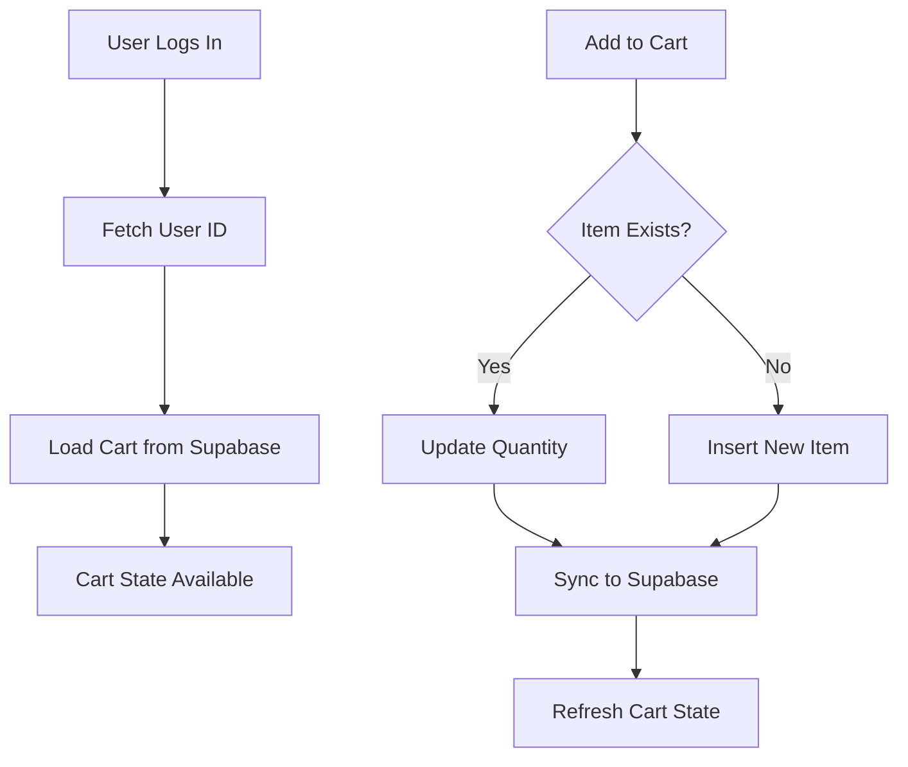

# cart-context.tsx

## High-Level Summary

A **React Context** for managing the shopping cart state. It provides cart operations (add, remove, update, clear) and syncs cart data with the Supabase database. The cart is persisted per user and automatically loads when the user logs in.

## Architecture & Logic



## Context Value Type

```typescript
interface CartContextType {
  items: CartItem[];           // Cart items array
  loading: boolean;            // Loading state
  addToCart: (productId, qty) => Promise<void>;
  removeFromCart: (productId) => Promise<void>;
  updateQuantity: (productId, qty) => Promise<void>;
  clearCart: () => Promise<void>;
  itemCount: number;           // Total items (sum of quantities)
  total: number;               // Total price in BDT
  refreshCart: () => Promise<void>;
}
```

## CartItem Interface

```typescript
interface CartItem {
  id: number;           // Cart item ID
  product_id: number;   // Product reference
  quantity: number;     // Quantity in cart
  product: {            // Joined product data
    id: number;
    name: string;
    price: number;
    images: string[] | null;
    stock: number;
    seller_id: number;
  };
}
```

## Provider: `CartProvider`

Wraps children with cart state and operations.

### State Variables

| State | Type | Description |
|-------|------|-------------|
| `items` | `CartItem[]` | Current cart items |
| `loading` | `boolean` | Cart loading state |
| `userId` | `number \| null` | Current user's DB ID |

### Effects

1. **Fetch User ID**: When `user` changes, fetch the user's database ID
2. **Load Cart**: When `userId` is set, fetch cart items from Supabase

## Functions

### `refreshCart(): Promise<void>`

**Purpose**: Reload cart items from the database.

**Query**:
```sql
SELECT id, product_id, quantity, products(id, name, price, images, stock, seller_id)
FROM cart_items
WHERE user_id = ?
```

---

### `addToCart(productId: number, quantity = 1): Promise<void>`

**Purpose**: Add a product to the cart or increment quantity if it exists.

**Logic**:
1. Check if product already in cart
2. If exists → `updateQuantity(existing + new)`
3. If new → Insert row into `cart_items`
4. Refresh cart state

---

### `removeFromCart(productId: number): Promise<void>`

**Purpose**: Remove a product from the cart completely.

**Query**:
```sql
DELETE FROM cart_items
WHERE user_id = ? AND product_id = ?
```

---

### `updateQuantity(productId: number, quantity: number): Promise<void>`

**Purpose**: Set a specific quantity for a cart item.

**Edge Case**: If `quantity <= 0`, removes the item instead.

---

### `clearCart(): Promise<void>`

**Purpose**: Remove all items from the user's cart.

**Query**:
```sql
DELETE FROM cart_items WHERE user_id = ?
```

## Computed Values

| Value | Calculation | Description |
|-------|-------------|-------------|
| `itemCount` | `reduce((sum, item) => sum + item.quantity, 0)` | Total number of items |
| `total` | `reduce((sum, item) => sum + price * quantity, 0)` | Total price in BDT |

## Hook: `useCart()`

**Purpose**: Access cart context from any component.

**Throws**: Error if used outside `CartProvider`.

**Example**:
```tsx
function CartIcon() {
  const { itemCount } = useCart();
  return <Badge>{itemCount}</Badge>;
}
```

## Dependencies

### External Modules
| Module | Purpose |
|--------|---------|
| `react` | Context API, hooks |

### Internal Modules
| Module | Purpose |
|--------|---------|
| `./supabase` | Supabase client |
| `@/components/auth-provider` | Current user state |

## Database Schema

The cart uses the `cart_items` table:

| Column | Type | Description |
|--------|------|-------------|
| `id` | INTEGER | Primary key |
| `user_id` | INTEGER | FK to users |
| `product_id` | INTEGER | FK to products |
| `quantity` | INTEGER | Item quantity |

## Usage Example

```tsx
function ProductCard({ product }) {
  const { addToCart, items } = useCart();
  
  const inCart = items.some(i => i.product_id === product.id);
  
  return (
    <button 
      onClick={() => addToCart(product.id)}
      disabled={inCart}
    >
      {inCart ? "In Cart" : "Add to Cart"}
    </button>
  );
}
```

## Notes

> [!IMPORTANT]
> The cart requires a logged-in user. Operations silently return if `userId` is null.

> [!TIP]
> The `total` is calculated from `product.price * quantity`. Ensure prices are in the same unit (BDT) throughout.

> [!NOTE]
> Cart data is persisted in Supabase, so it survives page refreshes and works across devices.

> [!WARNING]
> The `refreshCart` function fetches all cart items on every call. For large carts, consider optimistic updates instead.
