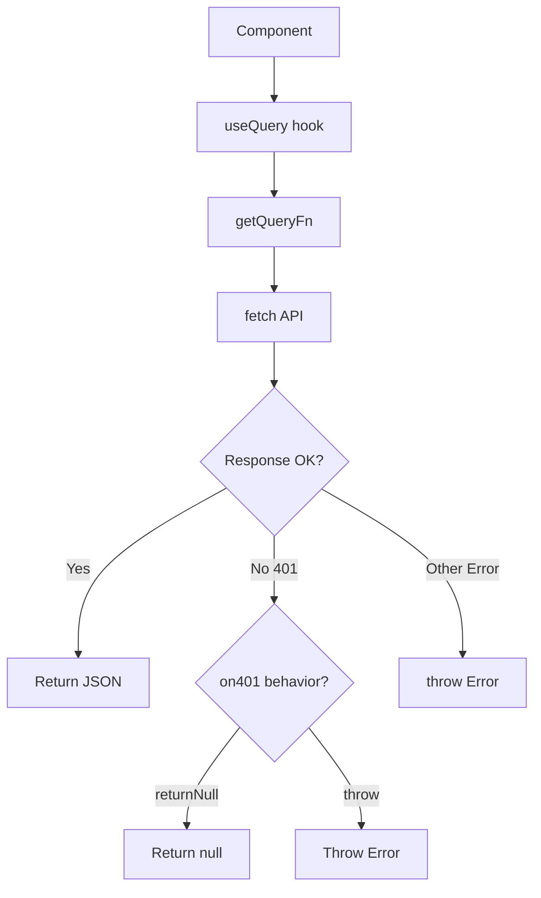

# queryClient.ts

## High-Level Summary

This file configures **React Query** (TanStack Query) for data fetching in the Eco-Haat application. It provides a pre-configured query client, an API request helper, and a customizable query function factory.

## Architecture & Logic



## Functions

### `throwIfResNotOk(res: Response): Promise<void>`

**Purpose**: Throws an error if the response is not OK (status 2xx).

**Error Format**: `"${status}: ${text}"`

**Example**:
```typescript
// For a 404 response with body "Not found"
// Throws: Error("404: Not found")
```

---

### `apiRequest(method, url, data?): Promise<Response>`

**Purpose**: Makes authenticated API requests with JSON body support.

**Parameters**:
| Param | Type | Description |
|-------|------|-------------|
| `method` | `string` | HTTP method (GET, POST, etc.) |
| `url` | `string` | Request URL |
| `data` | `unknown` | Optional request body |

**Features**:
- Sets `Content-Type: application/json` when data is provided
- Includes credentials for cookie-based auth
- Throws on non-2xx responses

**Example**:
```typescript
// POST request with body
const res = await apiRequest("POST", "/api/orders", { productId: 1 });
const order = await res.json();

// GET request
const res = await apiRequest("GET", "/api/products");
```

---

### `getQueryFn<T>(options): QueryFunction<T>`

**Purpose**: Factory function that creates query functions with configurable 401 handling.

**Options**:
| Option | Values | Description |
|--------|--------|-------------|
| `on401` | `"returnNull"` \| `"throw"` | Behavior on 401 Unauthorized |

**Query Key Behavior**:
The query key array is joined with `/` to form the URL:
```typescript
queryKey: ["api", "users", "1"]
// Fetches: "api/users/1"
```

**Example**:
```typescript
// Return null on 401 (for optional auth)
const queryFn = getQueryFn({ on401: "returnNull" });

// Throw on 401 (require auth)
const queryFn = getQueryFn({ on401: "throw" });
```

---

## Query Client Configuration

### Default Query Options

| Option | Value | Description |
|--------|-------|-------------|
| `queryFn` | `getQueryFn({ on401: "throw" })` | Default throws on 401 |
| `refetchInterval` | `false` | No automatic polling |
| `refetchOnWindowFocus` | `false` | No refetch on tab switch |
| `staleTime` | `Infinity` | Data never becomes stale |
| `retry` | `false` | No automatic retries |

### Default Mutation Options

| Option | Value | Description |
|--------|-------|-------------|
| `retry` | `false` | No automatic retries |

## Usage Examples

### Basic Query

```typescript
import { useQuery } from "@tanstack/react-query";

function UserProfile({ userId }) {
  const { data, isLoading } = useQuery({
    queryKey: ["api", "users", userId],
  });
  
  if (isLoading) return <Spinner />;
  return <div>{data.name}</div>;
}
```

### Query with Custom 401 Handling

```typescript
const { data } = useQuery({
  queryKey: ["api", "me"],
  queryFn: getQueryFn({ on401: "returnNull" }),
});

// data is null if not logged in, user object if logged in
```

### Mutation with apiRequest

```typescript
import { useMutation } from "@tanstack/react-query";
import { apiRequest } from "@/lib/queryClient";

const mutation = useMutation({
  mutationFn: (data) => apiRequest("POST", "/api/orders", data),
});
```

## Dependencies

### External Modules
| Module | Purpose |
|--------|---------|
| `@tanstack/react-query` | Data fetching library |

## Configuration Rationale

| Setting | Rationale |
|---------|-----------|
| `staleTime: Infinity` | Eco-Haat uses Supabase directly for most data; React Query is secondary |
| `retry: false` | Explicit error handling preferred over automatic retries |
| `refetchOnWindowFocus: false` | Prevents unexpected data updates |

## Notes

> [!TIP]
> Use `apiRequest` for mutations and `getQueryFn` for queries. They have consistent error handling.

> [!NOTE]
> Most data fetching in Eco-Haat bypasses React Query and uses Supabase directly. This client is primarily for the Express API endpoints.

> [!WARNING]
> The `staleTime: Infinity` means data won't automatically refresh. Call `queryClient.invalidateQueries()` to force updates.

> [!IMPORTANT]
> The default behavior throws on 401. For optional authentication (guest checkout, etc.), use `getQueryFn({ on401: "returnNull" })`.
