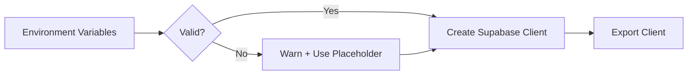

# supabase.ts

## High-Level Summary

This file initializes the **Supabase client** for the Eco-Haat frontend. Supabase provides authentication, database access, and real-time subscriptions. This client is used throughout the application for all database operations.

## Architecture & Logic



## Configuration

### Environment Variables

| Variable | Required | Description |
|----------|----------|-------------|
| `VITE_SUPABASE_URL` | Yes | Supabase project URL |
| `VITE_SUPABASE_ANON_KEY` | Yes | Supabase anonymous/public key |

### Example `.env` File

```env
VITE_SUPABASE_URL=https://your-project.supabase.co
VITE_SUPABASE_ANON_KEY=eyJhbGciOiJIUzI1NiIsInR5cCI6IkpXVCJ9...
```

## Exports

### `supabase`

**Type**: `SupabaseClient`

The configured Supabase client instance.

**Capabilities**:
- Authentication (`supabase.auth.*`)
- Database queries (`supabase.from('table').*`)
- Storage (`supabase.storage.*`)
- Realtime subscriptions (`supabase.channel()*`)

## Fallback Behavior

If environment variables are missing:

1. A console warning is logged
2. Placeholder values are used (client won't work, but app won't crash)

```typescript
supabase = createClient(
  supabaseUrl || "https://placeholder.supabase.co",
  supabaseAnonKey || "placeholder-key"
);
```

This prevents crashes during development setup or CI/CD.

## Usage Examples

### Authentication

```typescript
import { supabase } from "@/lib/supabase";

// Sign up
const { data, error } = await supabase.auth.signUp({
  email: "user@example.com",
  password: "password123",
});

// Sign in
const { data, error } = await supabase.auth.signInWithPassword({
  email: "user@example.com",
  password: "password123",
});

// Sign out
await supabase.auth.signOut();
```

### Database Queries

```typescript
// Select
const { data: products } = await supabase
  .from("products")
  .select("*")
  .eq("category_id", 1);

// Insert
const { data, error } = await supabase
  .from("orders")
  .insert({ buyer_id: userId, total_amount: 1500 })
  .select()
  .single();

// Update
await supabase
  .from("products")
  .update({ stock: newStock })
  .eq("id", productId);

// Delete
await supabase
  .from("cart_items")
  .delete()
  .eq("user_id", userId);
```

### Realtime Subscriptions

```typescript
const channel = supabase
  .channel("orders")
  .on(
    "postgres_changes",
    { event: "INSERT", schema: "public", table: "orders" },
    (payload) => console.log("New order:", payload)
  )
  .subscribe();
```

## Dependencies

### External Modules
| Module | Purpose |
|--------|---------|
| `@supabase/supabase-js` | Supabase JavaScript client |

### Environment
| Variable | Purpose |
|----------|---------|
| `import.meta.env.VITE_*` | Vite environment variable access |

## Security Notes

### Anonymous Key

The `VITE_SUPABASE_ANON_KEY` is a **public** key that:
- Can be exposed in client-side code
- Has limited permissions (defined by RLS policies)
- Should NOT be confused with the service role key

### Row Level Security (RLS)

All database access is controlled by Supabase RLS policies:

| Table | Policy Example |
|-------|----------------|
| `users` | Users can only read/update their own profile |
| `products` | Anyone can read; only sellers can insert/update |
| `orders` | Buyers see their orders; sellers see orders with their items |
| `cart_items` | Users only access their own cart |

## Notes

> [!IMPORTANT]
> The `VITE_SUPABASE_ANON_KEY` is safe to expose publicly. All security is enforced via Row Level Security (RLS) policies on the database.

> [!TIP]
> Use the Supabase Dashboard to set up RLS policies that match your application's permission model.

> [!WARNING]
> If you see "Missing Supabase environment variables" in the console, authentication and database features won't work.

> [!NOTE]
> The placeholder fallback prevents crashes but all Supabase operations will fail silently or with errors.
