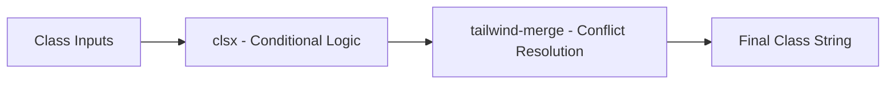

# utils.ts

## High-Level Summary

A utility module providing the `cn()` function, which is the standard utility for **merging Tailwind CSS classes** in React applications. It combines `clsx` for conditional classes and `tailwind-merge` for conflict resolution.

## Architecture & Logic



## Function: `cn(...inputs: ClassValue[])`

**Purpose**: Merge multiple class values intelligently, resolving Tailwind conflicts.

**Parameters**: 
- `...inputs` - Variable number of class values (strings, objects, arrays)

**Returns**: `string` - Merged class string

### What It Does

1. **clsx phase**: Handles conditionals, arrays, and objects
2. **tailwind-merge phase**: Resolves Tailwind class conflicts

### Example Usage

```tsx
import { cn } from "@/lib/utils";

// Basic merging
cn("px-4 py-2", "bg-blue-500")
// Output: "px-4 py-2 bg-blue-500"

// Conditional classes
cn("base-class", isActive && "active-class")
// Output: "base-class" or "base-class active-class"

// Object syntax
cn({ "text-red-500": hasError, "text-green-500": !hasError })
// Output: "text-red-500" or "text-green-500"

// Conflict resolution (tailwind-merge magic)
cn("px-4 px-8")
// Output: "px-8" (later wins)

cn("text-red-500", "text-blue-500")
// Output: "text-blue-500" (later wins)
```

### Real-World Component Example

```tsx
function Button({ variant, className, children }) {
  return (
    <button
      className={cn(
        // Base styles
        "px-4 py-2 rounded font-medium",
        // Variant styles
        variant === "primary" && "bg-blue-500 text-white",
        variant === "secondary" && "bg-gray-200 text-gray-800",
        // Consumer overrides
        className
      )}
    >
      {children}
    </button>
  );
}

// Usage
<Button variant="primary" className="px-8">
  Wider Button
</Button>
// className="py-2 rounded font-medium bg-blue-500 text-white px-8"
// Note: px-8 overrides px-4
```

## Dependencies

### External Modules
| Module | Purpose |
|--------|---------|
| `clsx` | Conditional class construction |
| `tailwind-merge` | Tailwind conflict resolution |

### Type Imports
| Type | Source | Description |
|------|--------|-------------|
| `ClassValue` | `clsx` | Valid input types for class merging |

## ClassValue Type

The `ClassValue` type accepts:

```typescript
type ClassValue = 
  | string 
  | number 
  | boolean 
  | undefined 
  | null 
  | { [key: string]: boolean } 
  | ClassValue[];
```

## Why This Pattern?

### Without tailwind-merge

```tsx
className={"px-4 " + (large ? "px-8" : "")}
// Output: "px-4 px-8" - CONFLICT! Unpredictable behavior
```

### With cn()

```tsx
className={cn("px-4", large && "px-8")}
// Output: "px-4" or "px-8" - Clean, predictable
```

## Common Use Cases

| Scenario | Example |
|----------|---------|
| Component variants | `cn(baseStyles, variants[variant])` |
| Conditional styling | `cn("base", isActive && "active")` |
| Consumer overrides | `cn(internalStyles, props.className)` |
| Responsive patterns | `cn("flex-col", "md:flex-row")` |

## Notes

> [!TIP]
> This is the standard pattern used by shadcn/ui. All UI components in this project use `cn()` for class management.

> [!NOTE]
> The `tailwind-merge` library understands Tailwind's utility structure and correctly merges classes, even complex ones like `hover:bg-blue-500` or `lg:px-4`.

> [!IMPORTANT]
> Always put consumer `className` last in `cn()` calls so users can override component defaults.
