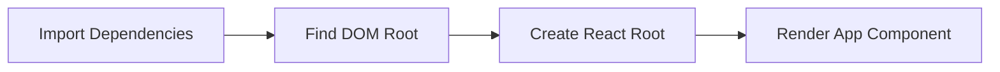

# main.tsx

## High-Level Summary

This is the **React application entry point** that bootstraps the app by mounting it to the DOM. It's the bridge between the HTML shell and the React component tree.

## Architecture & Logic

The file performs three essential tasks:



## Code Breakdown

```tsx
import { createRoot } from "react-dom/client";
import App from "./App";
import "./index.css";

createRoot(document.getElementById("root")!).render(<App />);
```

### Line-by-Line Explanation

| Line | Purpose |
|------|---------|
| `import { createRoot }` | React 18's concurrent rendering API |
| `import App` | The root application component |
| `import "./index.css"` | Global CSS styles (Tailwind + custom) |
| `createRoot(...)` | Creates a React root at the DOM element |
| `.render(<App />)` | Renders the application |

## Dependencies

### External Modules
| Module | Purpose |
|--------|---------|
| `react-dom/client` | React 18 DOM rendering |

### Internal Modules
| Module | Purpose |
|--------|---------|
| `./App` | Root React component |
| `./index.css` | Global stylesheet |

## React 18 Concurrent Features

Using `createRoot` (instead of legacy `ReactDOM.render`) enables:

- **Concurrent rendering** - React can interrupt and resume rendering
- **Automatic batching** - Multiple state updates are batched together
- **Transitions API** - Mark updates as non-urgent
- **Suspense improvements** - Better loading state handling

## Non-Null Assertion

```tsx
document.getElementById("root")!
```

The `!` asserts that `#root` exists. This is safe because:
1. The `<div id="root">` is defined in `index.html`
2. The script runs after the DOM is ready (ES modules are deferred)

## Error Handling

If `#root` doesn't exist, the app will crash with:
```
TypeError: Cannot read properties of null (reading 'render')
```

This is intentional—the app cannot function without a mount point.

## Notes

> [!TIP]
> This file should remain minimal. All application logic belongs in `App.tsx` or its children.

> [!NOTE]
> The CSS import here makes styles available globally. Vite processes this import and injects the styles into the page.

> [!IMPORTANT]
> React 18's `createRoot` is used instead of the legacy `ReactDOM.render`, enabling concurrent features and improved performance.
