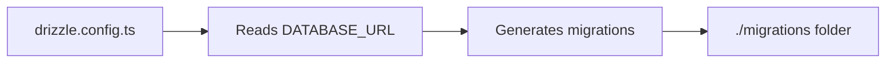

# drizzle.config.ts

## High-Level Summary

This file configures **Drizzle Kit**, the CLI tool for Drizzle ORM. It defines how database migrations are generated and where the schema file is located.

## Architecture & Logic

The configuration follows a simple pattern:

1. **Environment Validation**: Ensures `DATABASE_URL` is set before proceeding
2. **Configuration Export**: Exports a typed configuration object using `defineConfig`



## Configuration Options

| Option | Value | Description |
|--------|-------|-------------|
| `out` | `./migrations` | Output directory for generated SQL migration files |
| `schema` | `./shared/schema.ts` | Path to the Drizzle ORM schema definition |
| `dialect` | `postgresql` | Target database dialect (PostgreSQL via Supabase) |
| `dbCredentials.url` | `process.env.DATABASE_URL` | Database connection string |

## Dependencies

### External Modules
- `drizzle-kit` - CLI toolkit for Drizzle ORM

### Environment Variables
- `DATABASE_URL` - **Required**. PostgreSQL connection string (typically from Supabase)

## Usage

```bash
# Generate migrations based on schema changes
npx drizzle-kit generate

# Push schema directly to database (dev only)
npx drizzle-kit push

# Open Drizzle Studio (database GUI)
npx drizzle-kit studio
```

## Notes

> [!IMPORTANT]
> The `DATABASE_URL` environment variable must be set before running any Drizzle Kit commands.

> [!TIP]
> This configuration uses the shared schema at `./shared/schema.ts`, which is also used by the server for runtime database operations.
