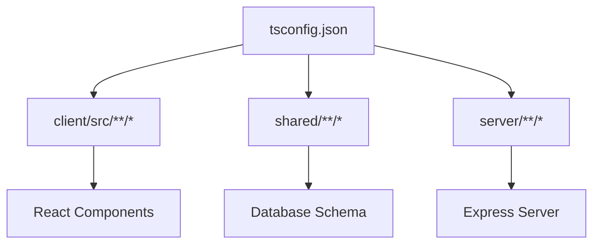

# tsconfig.json

## High-Level Summary

This is the **TypeScript configuration** for the Eco-Haat project. It defines compiler options, path aliases, and file inclusion/exclusion patterns for type checking across the entire monorepo (client, server, and shared code).

## Architecture & Logic

The configuration covers three main code areas:

## Configuration Breakdown

### Included Directories

| Directory | Purpose |
|-----------|---------|
| `client/src/**/*` | React frontend components, pages, and utilities |
| `shared/**/*` | Shared database schema and types |
| `server/**/*` | Express backend server code |

### Excluded Directories

| Directory | Reason |
|-----------|--------|
| `node_modules` | Third-party packages (already compiled) |
| `build` | Legacy build output |
| `dist` | Production build output |
| `**/*.test.ts` | Test files (may have different type requirements) |

### Compiler Options

| Option | Value | Description |
|--------|-------|-------------|
| `incremental` | `true` | Faster subsequent builds via caching |
| `tsBuildInfoFile` | `./node_modules/typescript/tsbuildinfo` | Cache location for incremental builds |
| `noEmit` | `true` | Type-check only; Vite handles transpilation |
| `module` | `ESNext` | Use ECMAScript modules |
| `strict` | `true` | Enable all strict type-checking options |
| `lib` | `esnext, dom, dom.iterable` | Available runtime APIs |
| `jsx` | `preserve` | Let Vite/Babel handle JSX transformation |
| `esModuleInterop` | `true` | Better CommonJS/ESM interoperability |
| `skipLibCheck` | `true` | Skip type checking of `.d.ts` files (faster) |
| `allowImportingTsExtensions` | `true` | Allow importing `.ts`/`.tsx` files directly |
| `moduleResolution` | `bundler` | Modern bundler-style module resolution |
| `types` | `node, vite/client` | Global type definitions to include |

### Path Aliases

| Alias | Target | Example |
|-------|--------|---------|
| `@/*` | `./client/src/*` | `import { Button } from "@/components/ui/button"` |
| `@shared/*` | `./shared/*` | `import { User } from "@shared/schema"` |

## Dependencies

This configuration requires:
- `typescript` - The TypeScript compiler
- `@types/node` - Node.js type definitions
- `vite` - Provides `vite/client` types for import.meta, etc.

## Notes

> [!IMPORTANT]
> The `noEmit: true` setting means TypeScript only performs type checking. Actual JavaScript output is handled by Vite's esbuild/SWC transformations.

> [!TIP]
> The path aliases defined here must match those in `vite.config.ts` for both type checking and runtime resolution to work correctly.

> [!NOTE]
> The `bundler` module resolution mode is optimized for modern bundlers like Vite and requires TypeScript 5.0+.
