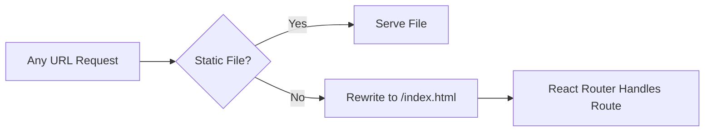

# vercel.json

## High-Level Summary

This is the **Vercel deployment configuration** for the Eco-Haat application. It configures URL rewrites to enable client-side routing in the single-page application (SPA).

## Architecture & Logic

The configuration implements a catch-all rewrite pattern essential for SPAs:



## Configuration

```json
{
  "rewrites": [
    {
      "source": "/(.*)",
      "destination": "/index.html"
    }
  ]
}
```

### Rewrite Rules

| Pattern | Behavior |
|---------|----------|
| `/(.*)`  | Matches any path (including nested routes) |
| → `/index.html` | All non-static requests serve the SPA entry point |

## How It Works

1. **Static Assets**: Files like `/assets/logo.png` are served directly
2. **API Routes**: If you had serverless functions, they'd be handled before rewrites
3. **All Other Routes**: Rewrites to `/index.html`, letting React Router handle navigation

### Example Routes

| Request | Served By |
|---------|-----------|
| `/` | index.html → React Router → Home page |
| `/shop` | index.html → React Router → Shop page |
| `/customer/orders` | index.html → React Router → Orders page |
| `/assets/style.css` | Static file (no rewrite) |

## Dependencies

- **Vercel Platform**: This configuration is Vercel-specific
- **React Router**: Client-side routing library that handles the actual navigation

## Notes

> [!IMPORTANT]
> Without this configuration, direct navigation to routes like `/shop` would return a 404 error on Vercel, because there's no actual `/shop/index.html` file.

> [!TIP]
> This is the minimal configuration for SPA hosting. Additional Vercel features (headers, redirects, environment variables) can be added here as needed.

> [!NOTE]
> The rewrite pattern is equivalent to the Apache `.htaccess` rule or Nginx `try_files` directive commonly used for SPAs.
