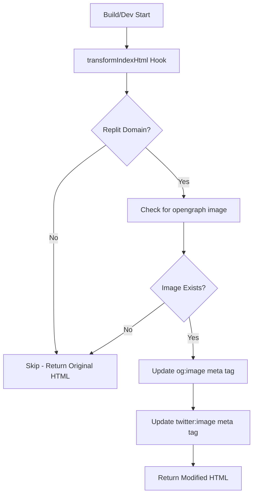

# vite-plugin-meta-images.ts

## High-Level Summary

This is a **custom Vite plugin** that automatically updates OpenGraph (`og:image`) and Twitter Card (`twitter:image`) meta tags in the HTML to point to the correct deployment URL. It's specifically designed for Replit deployments where the domain is dynamically assigned.

## Architecture & Logic

The plugin operates during Vite's HTML transformation phase:



## Functions/Methods

### `metaImagesPlugin()`

**Returns**: `Plugin` - A Vite plugin object

The main factory function that creates the plugin instance.

#### Plugin Hooks

| Hook | Purpose |
|------|---------|
| `name` | `'vite-plugin-meta-images'` - Plugin identifier |
| `transformIndexHtml` | Modifies HTML before serving/building |

---

### `getDeploymentUrl()`

**Returns**: `string | null` - The deployment base URL or null

Determines the deployment URL by checking Replit environment variables:

| Priority | Environment Variable | Example |
|----------|---------------------|---------|
| 1st | `REPLIT_INTERNAL_APP_DOMAIN` | `eco-haat.username.repl.co` |
| 2nd | `REPLIT_DEV_DOMAIN` | `eco-haat--username.repl.dev` |

---

### `log(...args: any[])`

**Purpose**: Conditional logging for production environments

Only outputs logs when `NODE_ENV === 'production'` to keep development console clean.

## Image Detection Logic

The plugin searches for OpenGraph images in the following order:

1. `client/public/opengraph.png`
2. `client/public/opengraph.jpg`
3. `client/public/opengraph.jpeg`

If none are found, the plugin skips meta tag updates.

## Regex Patterns

The plugin uses regex to find and replace meta tags:

```javascript
// OpenGraph image
/<meta\s+property="og:image"\s+content="[^"]*"\s*\/>/g

// Twitter image  
/<meta\s+name="twitter:image"\s+content="[^"]*"\s*\/>/g
```

## Dependencies

### External Modules
- `vite` - Provides the `Plugin` type
- `fs` - File system access for checking image existence
- `path` - Path resolution utilities

### Environment Variables
- `REPLIT_INTERNAL_APP_DOMAIN` - Production Replit domain
- `REPLIT_DEV_DOMAIN` - Development Replit domain
- `NODE_ENV` - Environment mode (controls logging)

## Usage

The plugin is automatically included in `vite.config.ts`:

```typescript
import { metaImagesPlugin } from "./vite-plugin-meta-images";

export default defineConfig({
  plugins: [
    metaImagesPlugin(),
    // ...
  ],
});
```

## Notes

> [!TIP]
> To use this plugin, place your OpenGraph image in `client/public/` as `opengraph.png`, `opengraph.jpg`, or `opengraph.jpeg`.

> [!NOTE]
> This plugin is Replit-specific. On Vercel or other platforms, the meta tags remain unchanged (you'd set them manually in `index.html`).

> [!WARNING]
> The regex patterns expect specific meta tag formats. If your HTML uses different attribute ordering, the replacement may fail silently.
