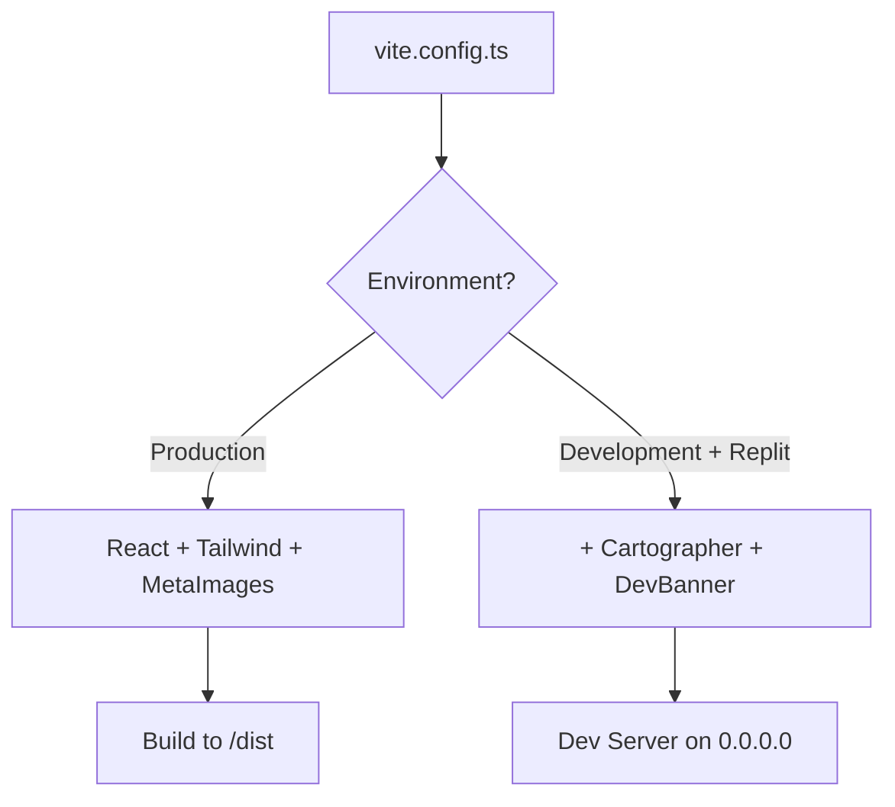

# vite.config.ts

## High-Level Summary

This is the main **Vite build configuration** for the Eco-Haat frontend. It configures React, Tailwind CSS, path aliases, and development server settings. The configuration also includes Replit-specific plugins for development.

## Architecture & Logic

The configuration dynamically loads plugins based on the environment:

## Configuration Breakdown

### Plugins

| Plugin | Purpose |
|--------|---------|
| `@vitejs/plugin-react` | React Fast Refresh and JSX support |
| `@tailwindcss/vite` | Tailwind CSS v4 integration |
| `@replit/vite-plugin-runtime-error-modal` | Displays runtime errors in a modal |
| `metaImagesPlugin` | Custom plugin for OpenGraph meta tags |
| `@replit/vite-plugin-cartographer` | Replit-specific dev tooling (dev only) |
| `@replit/vite-plugin-dev-banner` | Development banner (dev only) |

### Path Aliases

| Alias | Resolves To | Usage Example |
|-------|-------------|---------------|
| `@` | `./client/src` | `import { Button } from "@/components/ui/button"` |
| `@shared` | `./shared` | `import { User } from "@shared/schema"` |
| `@assets` | `./attached_assets` | `import logo from "@assets/logo.png"` |

### Build Configuration

| Option | Value | Description |
|--------|-------|-------------|
| `root` | `./client` | React app source directory |
| `base` | `/eco-hat/` (prod) or `/` (dev) | Public base path for assets |
| `outDir` | `./dist` | Production build output |
| `chunkSizeWarningLimit` | `1600` | Suppress warnings for large chunks |

### Dev Server

| Option | Value | Description |
|--------|-------|-------------|
| `host` | `0.0.0.0` | Accessible from any network interface |
| `allowedHosts` | `true` | Accept requests from any hostname |
| `fs.strict` | `true` | Prevent access outside project root |
| `fs.deny` | `["**/.*"]` | Block dotfiles from being served |

## Dependencies

### External Modules
- `vite` - Build tool and dev server
- `@vitejs/plugin-react` - React integration
- `@tailwindcss/vite` - Tailwind CSS v4 plugin
- `@replit/vite-plugin-runtime-error-modal` - Error display
- `path` - Node.js path utilities

### Internal Modules
- `./vite-plugin-meta-images` - Custom OpenGraph image plugin

### Environment Variables
- `NODE_ENV` - Determines production vs development mode
- `REPL_ID` - Replit environment detection
- `VERCEL` - Vercel deployment detection

## Notes

> [!TIP]
> The `base` path changes between production and development. On Vercel, it uses `/`, but on other production environments (like GitHub Pages), it uses `/eco-hat/`.

> [!NOTE]
> The Replit plugins (`cartographer`, `devBanner`) are only loaded in development when running inside a Replit environment.

> [!WARNING]
> The `fs.strict` and `fs.deny` settings are security measures to prevent serving sensitive files during development.
