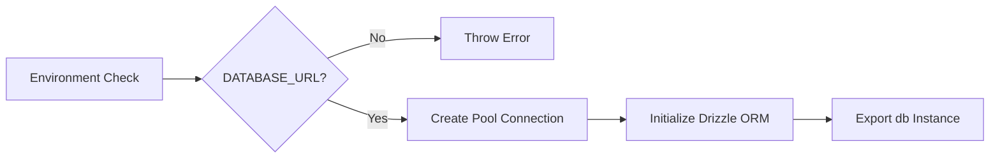

# db.ts

## High-Level Summary

This file establishes the **database connection** for the Eco-Haat backend using Drizzle ORM with PostgreSQL (Supabase). It exports a database instance that can be used throughout the server for all database operations.

## Architecture & Logic

The module follows a simple initialization pattern:



## Exports

### `pool`
**Type**: `Pool` (from `pg`)

The raw PostgreSQL connection pool. Generally not used directly—use the `db` export instead.

### `db`
**Type**: `DrizzleDatabase`

The Drizzle ORM database instance with schema types attached. Use this for all database queries.

**Example Usage**:
```typescript
import { db } from "./db";
import { users } from "@shared/schema";

const allUsers = await db.select().from(users);
```

## Dependencies

### External Modules
| Module | Purpose |
|--------|---------|
| `pg` | PostgreSQL client for Node.js |
| `drizzle-orm/node-postgres` | Drizzle adapter for node-postgres |

### Internal Modules
| Module | Purpose |
|--------|---------|
| `@shared/schema` | Database table definitions and types |

### Environment Variables
| Variable | Required | Description |
|----------|----------|-------------|
| `DATABASE_URL` | ✅ Yes | PostgreSQL connection string |

## Connection Configuration

The connection pool is configured with minimal options:

```typescript
new Pool({ connectionString: process.env.DATABASE_URL })
```

This uses pg's default pool settings:
- Max connections: 10
- Idle timeout: 10 seconds
- Connection timeout: 0 (no limit)

## Notes

> [!IMPORTANT]
> The `DATABASE_URL` must be set before the server starts. Missing this will crash the application with a clear error message.

> [!TIP]
> The schema is passed to `drizzle()` to enable type-safe queries and relations. All table definitions from `@shared/schema` are available.

> [!NOTE]
> This uses a connection pool rather than single connections, allowing efficient handling of concurrent database requests.
