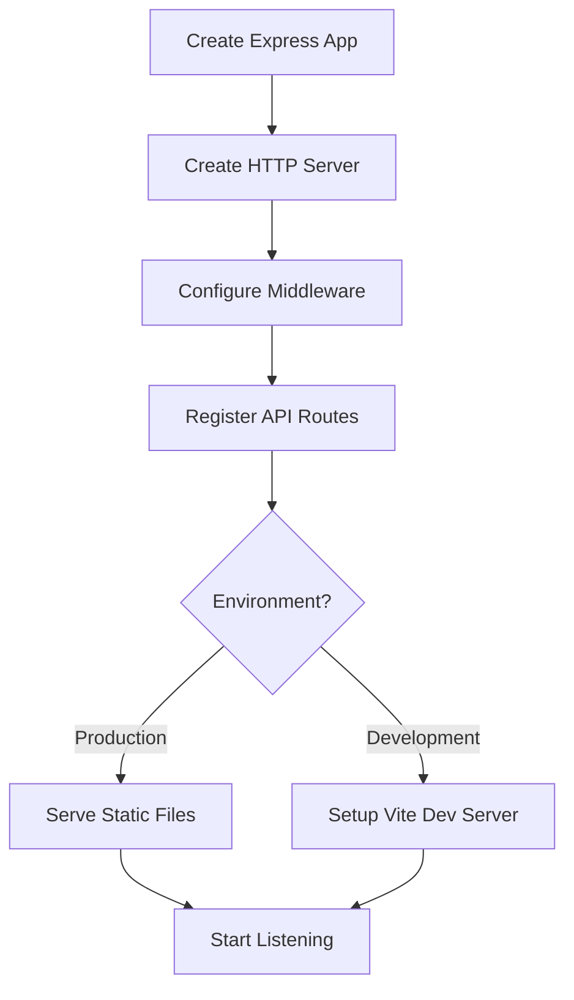

# index.ts

## High-Level Summary

This is the **main entry point** for the Eco-Haat Express server. It initializes the HTTP server, configures middleware, registers API routes, sets up static file serving, and starts listening on the configured port.

## Architecture & Logic

The server initialization follows this flow:



## Middleware Stack

| Order | Middleware | Purpose |
|-------|------------|---------|
| 1 | `express.json()` | Parse JSON request bodies |
| 2 | `express.urlencoded()` | Parse URL-encoded form data |
| 3 | Request Logger | Log API requests with timing |
| 4 | Routes | API endpoint handlers |
| 5 | Error Handler | Catch-all error response |
| 6 | Static/Vite | Serve frontend assets |

## Functions/Methods

### `log(message: string, source = "express")`

**Purpose**: Formatted logging utility for server operations.

**Parameters**:
| Param | Type | Default | Description |
|-------|------|---------|-------------|
| `message` | string | - | Log message content |
| `source` | string | `"express"` | Source identifier |

**Output Format**: `12:34:56 PM [express] Your message here`

---

### Request Logger Middleware

**Purpose**: Logs all `/api/*` requests with response time and JSON body.

**Log Format**: `GET /api/users/1 200 in 45ms :: {"id":1,"name":"..."}`

---

### Error Handler Middleware

**Purpose**: Catches unhandled errors and returns JSON error responses.

**Response Format**:
```json
{
  "message": "Error description"
}
```

**Status Codes**: Uses `err.status`, `err.statusCode`, or defaults to `500`.

## TypeScript Augmentation

The file extends the `http.IncomingMessage` interface:

```typescript
declare module "http" {
  interface IncomingMessage {
    rawBody: unknown;
  }
}
```

This allows access to the raw request body (used for webhook signature verification).

## Environment Modes

| Mode | Behavior |
|------|----------|
| **Production** | Serves pre-built static files from `/dist` |
| **Development** | Uses Vite middleware for HMR and on-the-fly compilation |

## Server Configuration

| Setting | Value | Description |
|---------|-------|-------------|
| Port | `process.env.PORT` or `5000` | Server listening port |
| Host | `0.0.0.0` | Accepts connections from any interface |

## Dependencies

### External Modules
| Module | Purpose |
|--------|---------|
| `express` | Web framework |
| `http` | Node.js HTTP server |

### Internal Modules
| Module | Purpose |
|--------|---------|
| `./routes` | API route registration |
| `./static` | Production static file serving |
| `./vite` | Development Vite integration |

### Environment Variables
| Variable | Required | Default | Description |
|----------|----------|---------|-------------|
| `PORT` | No | `5000` | Server port |
| `NODE_ENV` | No | - | Environment mode |

## Notes

> [!IMPORTANT]
> The server serves both the API (`/api/*`) and the frontend on the same port. This is required for Replit's firewall configuration.

> [!TIP]
> The `rawBody` property is preserved for webhook signature verification. Access it via `req.rawBody` in route handlers.

> [!WARNING]
> The error handler re-throws errors after responding. This ensures errors are logged but may cause issues with unhandled rejection warnings.

> [!NOTE]
> Vite is dynamically imported in development to avoid loading unnecessary modules in production.
