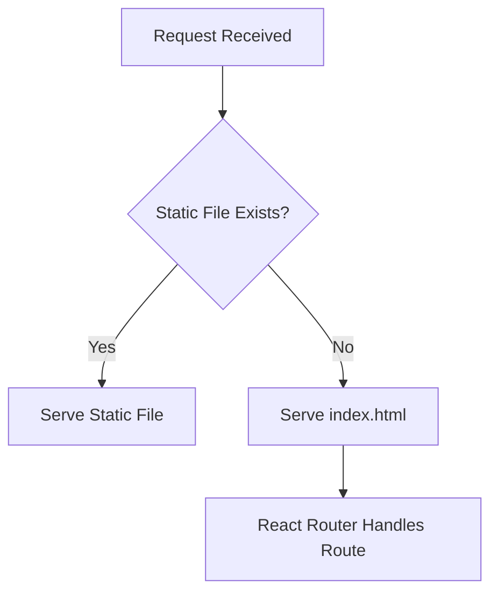

# static.ts

## High-Level Summary

This file handles **static file serving** for the production build. It serves the compiled React application from the `/dist` directory and implements a fallback to `index.html` for client-side routing.

## Architecture & Logic

The static serving follows the standard SPA deployment pattern:



## Functions/Methods

### `serveStatic(app: Express): void`

**Purpose**: Configures Express to serve the production build.

**Parameters**:
| Param | Type | Description |
|-------|------|-------------|
| `app` | `Express` | Express application instance |

**Throws**: `Error` if the `/dist` directory doesn't exist.

---

## Implementation Details

### Static File Handling

```typescript
app.use(express.static(distPath));
```

This serves files from `/dist` with proper MIME types and caching headers.

### SPA Fallback

```typescript
app.use("*", (_req, res) => {
  res.sendFile(path.resolve(distPath, "index.html"));
});
```

All unmatched routes (e.g., `/shop`, `/customer/orders`) serve `index.html`, allowing React Router to handle the navigation.

### Path Resolution

The dist path is resolved relative to the server file:

```typescript
const distPath = path.resolve(__dirname, "..", "dist");
// Results in: /project-root/dist
```

## Error Handling

If the build directory doesn't exist, the server fails fast with a helpful error:

```
Error: Could not find the build directory: /path/to/dist, make sure to build the client first
```

## Dependencies

### External Modules
| Module | Purpose |
|--------|---------|
| `express` | Static middleware and types |
| `fs` | File system checks |
| `path` | Path resolution |

## Usage Context

This module is only loaded in production mode:

```typescript
// In server/index.ts
if (process.env.NODE_ENV === "production") {
  serveStatic(app);
} else {
  // Use Vite dev server
}
```

## Build Requirement

Before running in production, build the client:

```bash
npm run build
# or
npx vite build
```

This creates the `/dist` directory with:
- `index.html` - Entry point
- `assets/` - Bundled JS, CSS, images

## Notes

> [!IMPORTANT]
> You must run `npm run build` before starting the server in production mode. The server will crash if `/dist` doesn't exist.

> [!TIP]
> The wildcard route (`*`) must be registered last, after all API routes, to avoid catching API requests.

> [!NOTE]
> This file is only used in production. In development, `vite.ts` provides HMR and on-the-fly compilation.
