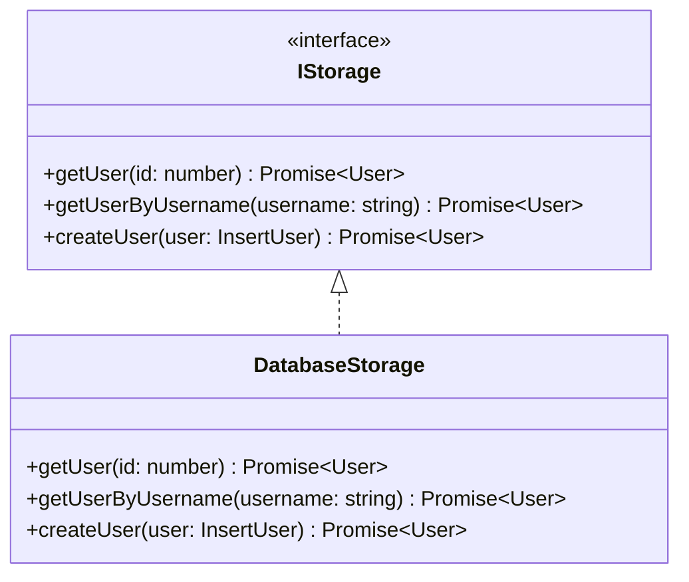

# storage.ts

## High-Level Summary

This file implements the **data access layer** (DAL) for the Eco-Haat application using the Repository pattern. It provides a clean abstraction over database operations, making it easy to swap implementations (e.g., for testing).

## Architecture & Logic

The module follows the Repository pattern with an interface and implementation:



## Interface: `IStorage`

Defines the contract for storage operations:

```typescript
export interface IStorage {
  getUser(id: number): Promise<User | undefined>;
  getUserByUsername(username: string): Promise<User | undefined>;
  createUser(user: InsertUser): Promise<User>;
}
```

## Class: `DatabaseStorage`

The production implementation using Drizzle ORM.

### Methods

#### `getUser(id: number): Promise<User | undefined>`

**Purpose**: Retrieves a user by their database ID.

**Parameters**:
| Param | Type | Description |
|-------|------|-------------|
| `id` | number | User's primary key |

**Returns**: User object or `undefined` if not found.

**Query**:
```typescript
db.select().from(users).where(eq(users.id, id))
```

---

#### `getUserByUsername(username: string): Promise<User | undefined>`

**Purpose**: Retrieves a user by their username.

**Parameters**:
| Param | Type | Description |
|-------|------|-------------|
| `username` | string | User's display name |

**Returns**: User object or `undefined` if not found.

**Query**:
```typescript
db.select().from(users).where(eq(users.username, username))
```

---

#### `createUser(insertUser: InsertUser): Promise<User>`

**Purpose**: Creates a new user in the database.

**Parameters**:
| Param | Type | Description |
|-------|------|-------------|
| `insertUser` | InsertUser | User data to insert |

**Returns**: The created User object with generated ID.

**Query**:
```typescript
db.insert(users).values(insertUser).returning()
```

## Exports

### `storage`

A singleton instance of `DatabaseStorage`:

```typescript
export const storage = new DatabaseStorage();
```

**Usage**:
```typescript
import { storage } from "./storage";

const user = await storage.getUser(1);
```

## Dependencies

### External Modules
| Module | Purpose |
|--------|---------|
| `drizzle-orm` | Query builder utilities (`eq`) |

### Internal Modules
| Module | Purpose |
|--------|---------|
| `@shared/schema` | Table definitions and types |
| `./db` | Database connection instance |

## Extension Points

To add new operations, extend both the interface and implementation:

```typescript
export interface IStorage {
  // Existing methods...
  getProducts(): Promise<Product[]>;
}

export class DatabaseStorage implements IStorage {
  // Existing methods...
  
  async getProducts(): Promise<Product[]> {
    return db.select().from(products);
  }
}
```

## Testing

The interface allows for easy mocking:

```typescript
const mockStorage: IStorage = {
  getUser: jest.fn().mockResolvedValue({ id: 1, username: "test" }),
  getUserByUsername: jest.fn(),
  createUser: jest.fn(),
};
```

## Notes

> [!TIP]
> The interface-based design enables dependency injection and easier testing. Consider creating a `MemoryStorage` implementation for tests.

> [!NOTE]
> The current implementation is minimal. Most database operations in Eco-Haat are performed directly via Supabase client on the frontend.

> [!IMPORTANT]
> The destructuring pattern `[user]` assumes at most one result. This is safe for unique lookups but would miss multiple matches for non-unique queries.
