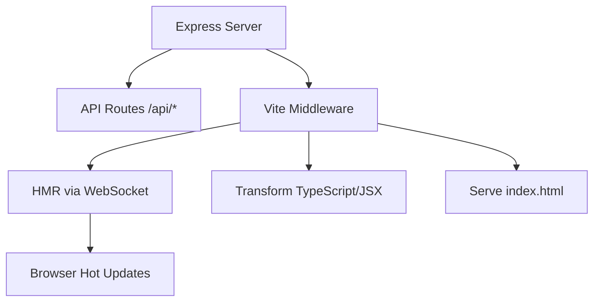

# vite.ts

## High-Level Summary

This file integrates **Vite's development server** with the Express backend. It enables Hot Module Replacement (HMR), on-the-fly TypeScript/JSX compilation, and seamless frontend development without a separate dev server.

## Architecture & Logic

The setup creates a unified development server:



## Functions/Methods

### `setupVite(server: Server, app: Express): Promise<void>`

**Purpose**: Configures Vite as Express middleware for development.

**Parameters**:
| Param | Type | Description |
|-------|------|-------------|
| `server` | `Server` | HTTP server instance (for HMR WebSocket) |
| `app` | `Express` | Express application |

---

## Configuration

### Server Options

```typescript
const serverOptions = {
  middlewareMode: true,     // Use Vite as middleware, not standalone
  hmr: { 
    server,                 // Attach HMR to existing HTTP server
    path: "/vite-hmr"       // WebSocket path for HMR
  },
  allowedHosts: true,       // Accept any hostname
};
```

### Vite Server Creation

```typescript
const vite = await createViteServer({
  ...viteConfig,            // Base config from vite.config.ts
  configFile: false,        // Don't reload config file
  customLogger: {...},      // Custom error handling
  server: serverOptions,
  appType: "custom",        // Not a standalone SPA
});
```

### Custom Logger

The custom logger exits the process on errors to ensure fatal issues aren't silently ignored:

```typescript
customLogger: {
  ...viteLogger,
  error: (msg, options) => {
    viteLogger.error(msg, options);
    process.exit(1);  // Hard fail on errors
  },
}
```

## Middleware Registration

### Vite Middleware
```typescript
app.use(vite.middlewares);
```

Handles:
- TypeScript/JSX compilation
- CSS modules
- Static asset serving
- HMR WebSocket

### SPA Fallback Handler

```typescript
app.use("*", async (req, res, next) => {
  // Load and transform index.html
});
```

This handler:
1. Reads `client/index.html` from disk (always fresh)
2. Adds cache-busting to the main entry point
3. Applies Vite's HTML transformations
4. Sends the result to the browser

### Cache Busting

```typescript
template = template.replace(
  `src="/src/main.tsx"`,
  `src="/src/main.tsx?v=${nanoid()}"`
);
```

Ensures the browser always fetches the latest version during development.

## Error Handling

SSR stack traces are fixed for better debugging:

```typescript
vite.ssrFixStacktrace(e as Error);
```

## Dependencies

### External Modules
| Module | Purpose |
|--------|---------|
| `express` | Web framework |
| `vite` | Build tool and dev server |
| `http` | Server types |
| `fs` | File system access |
| `path` | Path resolution |
| `nanoid` | Unique ID generation |

### Internal Modules
| Module | Purpose |
|--------|---------|
| `../vite.config` | Build configuration |

## HMR Path

The HMR WebSocket connects at `/vite-hmr`:

```
ws://localhost:5000/vite-hmr
```

This is separate from regular WebSocket traffic if you add that later.

## Notes

> [!IMPORTANT]
> This file is only used in development. In production, `static.ts` serves pre-built files instead.

> [!TIP]
> The `appType: "custom"` setting tells Vite that we're handling HTML serving ourselves, not using automatic SPA mode.

> [!WARNING]
> The custom logger exits on errors. This is intentional to catch configuration issues early but may be too aggressive for some use cases.

> [!NOTE]
> The index.html is read on every request, allowing live edits to the HTML template without server restart.
