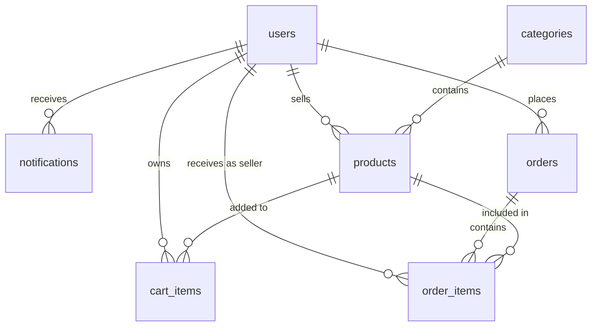

# schema.ts

## High-Level Summary

This file defines the **database schema** for the entire Eco-Haat application using Drizzle ORM. It includes table definitions, column types, relationships, Zod validation schemas, and TypeScript type exports.

## Architecture & Logic

The schema is organized into logical entities that model an e-commerce marketplace:



## Table Definitions

### `users`

Central user table supporting all roles (buyer, seller, admin).

| Column | Type | Constraints | Description |
|--------|------|-------------|-------------|
| `id` | SERIAL | PK | Auto-increment primary key |
| `userId` | TEXT | UNIQUE | Custom ID: USR/SLR/ADM-YYYYMMDD-XXX |
| `username` | TEXT | NOT NULL | Display name or shop name |
| `email` | TEXT | NOT NULL, UNIQUE | User email |
| `phone` | TEXT | - | Phone number |
| `role` | TEXT | NOT NULL, DEFAULT 'buyer' | User role |
| `isSuperAdmin` | BOOLEAN | DEFAULT false | Super admin flag |
| `fullName` | TEXT | - | Full name |
| `avatarUrl` | TEXT | - | Profile picture URL |
| `bio` | TEXT | - | User biography |
| `savedAddresses` | JSONB | DEFAULT [] | Saved addresses array |
| `shopLocation` | TEXT | - | Seller's shop location |
| `shopType` | TEXT | - | Shop type (Permanent, Overseas) |
| `verificationStatus` | TEXT | DEFAULT 'none' | Verification state |
| `identityDocuments` | TEXT[] | - | Document URLs array |
| `rejectionReason` | TEXT | - | Verification rejection reason |
| `createdAt` | TIMESTAMP | DEFAULT NOW() | Creation timestamp |

---

### `notifications`

User notification system.

| Column | Type | Constraints | Description |
|--------|------|-------------|-------------|
| `id` | SERIAL | PK | Primary key |
| `userId` | INTEGER | FK → users.id, NOT NULL | Notification recipient |
| `title` | TEXT | NOT NULL | Notification title |
| `message` | TEXT | NOT NULL | Notification body |
| `type` | TEXT | DEFAULT 'info' | Type: info, success, warning, error |
| `read` | BOOLEAN | DEFAULT false | Read status |
| `createdAt` | TIMESTAMP | DEFAULT NOW() | Creation time |

---

### `categories`

Product categories.

| Column | Type | Constraints | Description |
|--------|------|-------------|-------------|
| `id` | SERIAL | PK | Primary key |
| `name` | TEXT | NOT NULL, UNIQUE | Category name |
| `slug` | TEXT | NOT NULL, UNIQUE | URL-friendly slug |
| `description` | TEXT | - | Category description |
| `icon` | TEXT | - | Lucide icon name or URL |
| `color` | TEXT | - | Tailwind class or hex |
| `imageUrl` | TEXT | - | Category image |

---

### `products`

Marketplace products.

| Column | Type | Constraints | Description |
|--------|------|-------------|-------------|
| `id` | SERIAL | PK | Primary key |
| `name` | TEXT | NOT NULL | Product name |
| `description` | TEXT | NOT NULL | Product description |
| `price` | INTEGER | NOT NULL | Price in BDT (paisa) |
| `originalPrice` | INTEGER | - | Original price for discounts |
| `stock` | INTEGER | NOT NULL, DEFAULT 0 | Available quantity |
| `categoryId` | INTEGER | FK → categories.id | Product category |
| `sellerId` | INTEGER | FK → users.id | Product seller |
| `images` | TEXT[] | - | Image URL array |
| `tags` | TEXT[] | - | Product tags |
| `isEcoFriendly` | BOOLEAN | DEFAULT true | Eco-friendly flag |
| `features` | JSONB | - | Flexible features object |
| `createdAt` | TIMESTAMP | DEFAULT NOW() | Creation time |
| `updatedAt` | TIMESTAMP | DEFAULT NOW() | Last update time |

---

### `orders`

Customer orders.

| Column | Type | Constraints | Description |
|--------|------|-------------|-------------|
| `id` | SERIAL | PK | Primary key |
| `orderNumber` | TEXT | UNIQUE | Format: EH-YYYYMMDD-XXX |
| `buyerId` | INTEGER | FK → users.id | Order placer |
| `totalAmount` | INTEGER | NOT NULL | Total in BDT |
| `subtotal` | INTEGER | - | Subtotal before fees |
| `deliveryCharge` | INTEGER | - | Delivery fee |
| `codCharge` | INTEGER | - | COD fee |
| `status` | TEXT | NOT NULL, DEFAULT 'pending' | Order status |
| `denialReason` | TEXT | - | Denial reason if rejected |
| `phone` | TEXT | NOT NULL | Contact phone |
| `paymentMethod` | TEXT | NOT NULL, DEFAULT 'cod' | Payment type |
| `shippingAddress` | JSONB | NOT NULL | Shipping address object |
| `trackingHistory` | JSONB | DEFAULT [] | Tracking events array |
| `createdAt` | TIMESTAMP | DEFAULT NOW() | Order time |

---

### `orderItems`

Individual items within orders.

| Column | Type | Constraints | Description |
|--------|------|-------------|-------------|
| `id` | SERIAL | PK | Primary key |
| `orderId` | INTEGER | FK → orders.id | Parent order |
| `productId` | INTEGER | FK → products.id | Ordered product |
| `sellerId` | INTEGER | FK → users.id | Product seller |
| `quantity` | INTEGER | NOT NULL | Item quantity |
| `priceAtPurchase` | INTEGER | NOT NULL | Price when ordered |
| `sellerEarning` | INTEGER | - | Seller's portion |
| `itemStatus` | TEXT | DEFAULT 'pending' | Item-specific status |
| `denialReason` | TEXT | - | Item denial reason |
| `options` | JSONB | - | Selected options |
| `createdAt` | TIMESTAMP | DEFAULT NOW() | Creation time |

---

### `cartItems`

Shopping cart items.

| Column | Type | Constraints | Description |
|--------|------|-------------|-------------|
| `id` | SERIAL | PK | Primary key |
| `userId` | INTEGER | FK → users.id | Cart owner |
| `productId` | INTEGER | FK → products.id | Product in cart |
| `quantity` | INTEGER | NOT NULL, DEFAULT 1 | Quantity |
| `createdAt` | TIMESTAMP | DEFAULT NOW() | Added time |

---

## Zod Schemas

Input validation schemas generated from table definitions:

| Schema | Omits | Purpose |
|--------|-------|---------|
| `insertUserSchema` | id, createdAt | User creation validation |
| `insertProductSchema` | id, createdAt, updatedAt | Product creation validation |
| `insertCategorySchema` | id | Category creation validation |
| `insertOrderSchema` | id, createdAt | Order creation validation |
| `insertCartItemSchema` | id, createdAt | Cart item validation |

---

## TypeScript Types

### Select Types (Full Record)

| Type | Description |
|------|-------------|
| `User` | Complete user record from database |
| `Product` | Complete product record |
| `Category` | Complete category record |
| `Order` | Complete order record |
| `OrderItem` | Complete order item record |
| `CartItem` | Complete cart item record |

### Insert Types (For Creation)

| Type | Description |
|------|-------------|
| `InsertUser` | User creation data |
| `InsertProduct` | Product creation data |
| `InsertCategory` | Category creation data |

---

## Dependencies

### External Modules
| Module | Purpose |
|--------|---------|
| `drizzle-orm` | SQL utilities |
| `drizzle-orm/pg-core` | PostgreSQL column types |
| `drizzle-zod` | Schema to Zod conversion |
| `zod` | Runtime validation |

---

## Usage Examples

### Creating a User
```typescript
import { users, insertUserSchema, InsertUser } from "@shared/schema";

const userData: InsertUser = {
  username: "johndoe",
  email: "john@example.com",
  role: "buyer",
};

// Validate
const validated = insertUserSchema.parse(userData);

// Insert
await db.insert(users).values(validated);
```

### Querying Products
```typescript
import { products, Product } from "@shared/schema";
import { eq } from "drizzle-orm";

const sellerProducts: Product[] = await db
  .select()
  .from(products)
  .where(eq(products.sellerId, 1));
```

---

## Notes

> [!IMPORTANT]
> This schema is shared between the server and client via the `@shared` path alias. Any changes affect both.

> [!TIP]
> The `JSONB` columns (`savedAddresses`, `features`, `shippingAddress`, `trackingHistory`, `options`) allow flexible, schema-less data storage.

> [!WARNING]
> Price values are stored as integers (representing BDT). Ensure frontend properly converts to/from display format.

> [!NOTE]
> The `verificationStatus` field supports a seller verification workflow: none → pending → verified/rejected.
