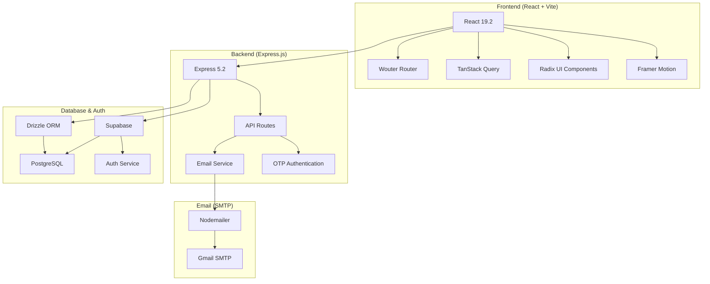
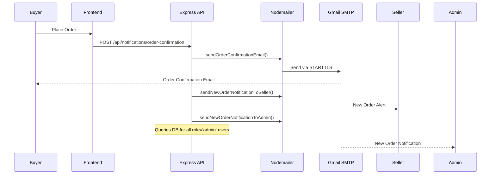

# Eco-Haat Codebase Analysis

## 📋 Project Overview

**Eco-Haat** is a sustainable e-commerce marketplace for Bangladesh, connecting local artisans and eco-friendly sellers with environmentally conscious buyers. The application supports three user types: **Buyers**, **Sellers**, and **Administrators**.

---

## 🏗️ Architecture Overview



---

## 📁 Directory Structure

| Directory | Purpose |
|-----------|---------|
| `client/` | React frontend application |
| `client/src/pages/` | 23 route pages (home, auth, shop, seller, admin) |
| `client/src/components/` | 64 reusable UI components |
| `client/src/lib/` | Utilities, Supabase client, cart context, i18n |
| `server/` | Express.js backend |
| `shared/` | Shared TypeScript schema (Drizzle ORM) |
| `email-templates/` | 10 HTML email templates |
| `sql/` | Database migration scripts |

---

## 🔧 Technology Stack

### Frontend
| Technology | Version | Purpose |
|------------|---------|---------|
| React | 19.2.0 | UI Framework |
| Vite | 7.1.9 | Build Tool |
| Wouter | 3.3.5 | Lightweight Router |
| TanStack Query | 5.60.5 | Server State Management |
| Radix UI | Various | Accessible UI Primitives |
| Framer Motion | 12.23.24 | Animations |
| Tailwind CSS | 4.1.14 | Styling |

### Backend
| Technology | Version | Purpose |
|------------|---------|---------|
| Express.js | 5.2.1 | HTTP Server |
| Drizzle ORM | 0.45.1 | Database ORM |
| Nodemailer | 7.0.12 | Email Sending |
| Supabase SDK | 2.90.1 | Auth & Database Client |
| PostgreSQL | - | Database |

---

## 🗄️ Database Schema

### Tables

#### `users`
```typescript
{
  id: serial PRIMARY KEY,
  userId: text UNIQUE,        // USR/SLR/ADM-YYYYMMDD-XXX format
  username: text,             // Display name or Shop Name
  email: text UNIQUE,
  phone: text,
  role: text DEFAULT 'buyer', // buyer, seller, uv-seller, admin
  isSuperAdmin: boolean,
  fullName: text,
  avatarUrl: text,
  bio: text,
  savedAddresses: jsonb,
  // Seller Verification
  shopLocation: text,
  shopType: text,
  verificationStatus: text,   // none, pending, verified, rejected
  identityDocuments: text[],
  rejectionReason: text,
  createdAt: timestamp
}
```

#### `products`
```typescript
{
  id: serial PRIMARY KEY,
  name: text,
  description: text,
  price: integer,             // In BDT
  originalPrice: integer,
  stock: integer,
  categoryId: integer FK → categories,
  sellerId: integer FK → users,
  images: text[],
  tags: text[],
  isEcoFriendly: boolean,
  features: jsonb,
  createdAt, updatedAt: timestamp
}
```

#### `orders`
```typescript
{
  id: serial PRIMARY KEY,
  orderNumber: text UNIQUE,   // EH-YYYYMMDD-XXX format
  buyerId: integer FK → users,
  totalAmount: integer,
  subtotal, deliveryCharge, codCharge: integer,
  status: text DEFAULT 'pending',
  denialReason: text,
  phone: text,
  paymentMethod: text DEFAULT 'cod',
  shippingAddress: jsonb,
  trackingHistory: jsonb,
  createdAt: timestamp
}
```

#### `order_items`
```typescript
{
  id: serial PRIMARY KEY,
  orderId: integer FK → orders,
  productId: integer FK → products,
  sellerId: integer FK → users,
  quantity: integer,
  priceAtPurchase: integer,
  sellerEarning: integer,
  itemStatus: text DEFAULT 'pending',
  denialReason: text,
  options: jsonb,
  createdAt: timestamp
}
```

---

## 📧 SMTP Email System (Deep Dive)

### Configuration

The SMTP system is configured in [email.ts](file:///c:/Users/Adnan%20Shahria/Downloads/Eco-Haat/Eco-Haat/server/email.ts) using **Nodemailer**.

#### Environment Variables Required
| Variable | Default | Description |
|----------|---------|-------------|
| `SMTP_HOST` | `smtp.gmail.com` | SMTP server hostname |
| `SMTP_PORT` | `587` | SMTP port (TLS) |
| `SMTP_USER` | - | Gmail address |
| `SMTP_PASS` | - | Gmail App Password (16-char) |
| `SMTP_FROM` | Auto-generated | Sender display name |
| `ADMIN_EMAIL` | - | Fallback admin email |

#### Transporter Setup
```typescript
const transporter = nodemailer.createTransport({
    host: process.env.SMTP_HOST || "smtp.gmail.com",
    port: parseInt(process.env.SMTP_PORT || "587"),
    secure: false,  // Uses STARTTLS
    auth: {
        user: process.env.SMTP_USER,
        pass: process.env.SMTP_PASS,
    },
});
```

### Email Functions

| Function | Purpose | Recipients |
|----------|---------|------------|
| `sendEmail()` | Core sender function | Any |
| `sendWelcomeEmail()` | New user registration | Buyer/Seller |
| `sendOrderConfirmationEmail()` | Order placed | Buyer |
| `sendOrderStatusEmail()` | Status updates | Buyer |
| `sendNewOrderNotificationToSeller()` | New pending order | Seller |
| `sendOrderStatusEmailToSeller()` | Order updates | Seller |
| `sendNewOrderNotificationToAdmin()` | New order alert | All Admins |
| `sendOrderStatusEmailToAdmin()` | Status changes | All Admins |
| `sendOTPEmail()` | OTP verification | Any user |

### Email Flow Diagram



### Admin Email Distribution Logic

Located in [routes.ts](file:///c:/Users/Adnan%20Shahria/Downloads/Eco-Haat/Eco-Haat/server/routes.ts#L136-L178):

```typescript
// Fetch all admin users from database
const admins = await db.select({ email: users.email })
    .from(users)
    .where(eq(users.role, "admin"));

// Combine DB admins + env variable admin
const recipients = new Set<string>();
admins.forEach(a => { if (a.email) recipients.add(a.email); });
if (process.env.ADMIN_EMAIL) recipients.add(process.env.ADMIN_EMAIL);

// Send to each unique admin
for (const email of Array.from(recipients)) {
    await sendNewOrderNotificationToAdmin(email, orderNumber, total, buyerName);
}
```

### OTP Authentication Flow

| Endpoint | Purpose |
|----------|---------|
| `POST /api/auth/send-otp` | Generate & send 6-digit OTP |
| `POST /api/auth/verify-otp` | Validate OTP code |

OTP purposes: `registration`, `forgot_password`, `login`

OTPs are stored in Supabase `otp_codes` table with 5-minute expiry.

---

## 🔐 API Endpoints

### Email Notifications
| Endpoint | Method | Description |
|----------|--------|-------------|
| `/api/notifications/welcome` | POST | Send welcome email |
| `/api/notifications/order-confirmation` | POST | Order confirmation to buyer |
| `/api/notifications/order-status` | POST | Status update to buyer |
| `/api/notifications/seller/new-order` | POST | New order to seller |
| `/api/notifications/seller/order-status` | POST | Status update to seller |
| `/api/notifications/admin/new-order` | POST | New order to all admins |
| `/api/notifications/admin/order-status` | POST | Status update to all admins |
| `/api/notifications/admin/send` | POST | Custom admin notification |

### Authentication
| Endpoint | Method | Description |
|----------|--------|-------------|
| `/api/auth/send-otp` | POST | Generate and email OTP |
| `/api/auth/verify-otp` | POST | Verify OTP code |

### Users
| Endpoint | Method | Description |
|----------|--------|-------------|
| `/api/users/:id` | GET | Get user by ID |

---

## 🌐 Frontend Pages

### Public Routes
- `/` - Landing page
- `/auth` - Login/Register
- `/privacy-policy`, `/terms-of-service`
- `/track-order/:id` - Order tracking

### Customer Routes
- `/shop` - Product catalog
- `/shop/cart` - Shopping cart
- `/shop/checkout` - Checkout flow
- `/shop/product/:id` - Product detail
- `/shop/orders` - Order history
- `/profile` - User profile

### Seller Routes
- `/seller` - Seller dashboard
- `/seller/orders`, `/seller/products`, `/seller/earnings`
- `/seller/add-product`, `/seller/edit-product/:id`
- `/seller/verification` - Seller verification

### Admin Routes (Protected)
- `/admin` - Admin dashboard
- `/admin/sellers`, `/admin/products`, `/admin/users`, `/admin/orders`
- `/admin/verify-seller/:id`, `/admin/verify-product/:id`

---

## 📱 Email Templates

10 pre-built HTML templates in `email-templates/`:

| Template | Recipient | Trigger |
|----------|-----------|---------|
| `1-confirm-signup.html` | User | Supabase signup |
| `2-magic-link.html` | User | Passwordless login |
| `3-reset-password.html` | User | Password reset |
| `4-change-email.html` | User | Email change confirmation |
| `order-confirmation-buyer.html` | Buyer | Order placed |
| `new-order-seller.html` | Seller | New order received |
| `order-shipped.html` | Buyer | Order shipped |
| `order-delivered.html` | Buyer | Order delivered |
| `admin-notification.html` | Admin | Various alerts |
| `supabase-email-templates.html` | - | Reference for Supabase dashboard |

---

## 🚀 Deployment

### Vercel Configuration
- API routes rewritten to `/api/:path*`
- SPA fallback to `/index.html`
- Security headers: X-Content-Type-Options, X-Frame-Options, X-XSS-Protection

### Required Environment Variables (Vercel)
```bash
VITE_SUPABASE_URL=https://your-project.supabase.co
VITE_SUPABASE_ANON_KEY=your-anon-key
DATABASE_URL=postgresql://...
SMTP_HOST=smtp.gmail.com
SMTP_PORT=587
SMTP_USER=your-email@gmail.com
SMTP_PASS=xxxx-xxxx-xxxx-xxxx
SMTP_FROM="EcoHaat" <your-email@gmail.com>
ADMIN_EMAIL=admin@example.com
```

---

## ⚠️ Key Observations & Potential Issues

### SMTP System
1. **Credential Check**: Emails silently fail if `SMTP_USER` or `SMTP_PASS` not set
2. **Gmail App Password**: Requires 2FA enabled + app-specific password
3. **No Retry Logic**: Failed emails are not retried
4. **Logging**: Good console logging exists (`✅`/`❌` emojis)

### Admin Notifications
1. **Dual Source**: Admins fetched from both DB (`role='admin'`) AND `ADMIN_EMAIL` env var
2. **Deduplication**: Uses `Set<string>` to prevent duplicate emails
3. **Error Handling**: Individual failures don't block other recipients

### OTP System
1. **Supabase Dependency**: Requires `otp_codes` table in Supabase
2. **5-Minute Expiry**: Hardcoded in code
3. **Single Use**: OTPs marked as `used` after verification

---

## 📊 Summary Statistics

| Metric | Count |
|--------|-------|
| Total Pages | 23 |
| UI Components | 64 |
| Server Files | 8 |
| Email Templates | 10 |
| Database Tables | 6 |
| API Endpoints | ~12 |
| Dependencies | 58 |
